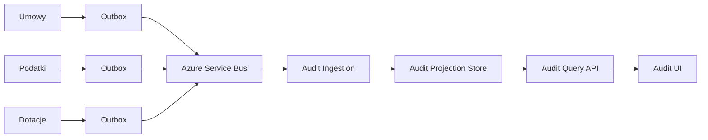

# 00. Executive Summary

## Jednozdaniowe podsumowanie

Buduję MVP, które zamienia techniczny `AuditLog` w czytelną historię zmian na umowie, aby skarbnik mógł szybko przygotować odpowiedź dla RIO.

---

## Problem

Skarbnik nie potrzebuje „przeglądarki logów”. Potrzebuje odpowiedzieć na konkretne pytania:

- kto zmienił umowę,
- kiedy to zrobił,
- co dokładnie zostało zmienione,
- czy zmiany dotyczą umowy, aneksu, harmonogramu, faktury, pliku lub finansowania.

---

## Rozwiązanie MVP

MVP to:

- REST API nad istniejącym `AuditLog`,
- React UI z widokiem timeline,
- wybór zdarzeń na timeline,
- tooltipy i szczegółową kartę aktywnej zmiany,
- mapowanie nazw technicznych na język użytkownika,
- krótkie podsumowanie historii zmian.

---

## Dlaczego nie buduję więcej?

Zadanie mówi wprost: **MVP na próbkę, nie produkcja, nie buduj więcej niż trzeba**.

Dlatego świadomie nie implementuję:

- Event Sourcingu,
- GraphQL,
- mikroserwisu,
- LLM,
- eksportu PDF,
- pełnego systemu auth.

Te elementy mogą mieć sens produkcyjnie, ale nie są konieczne do sprawdzenia wartości MVP.

---

## Docelowa ewolucja

Jeżeli za 6 miesięcy pojawią się moduły Podatki i Dotacje, a audit przestanie pochodzić z jednej bazy SQL, wtedy rozwiązanie powinno ewoluować w stronę event-driven audit platform:

---

## Kryterium sukcesu

MVP uznaję za udane, jeżeli skarbnik potrafi znaleźć odpowiedź na pytanie RIO w mniej niż minutę bez pomocy IT.

[Next: Problem Discovery](01-problem-discovery.md)
