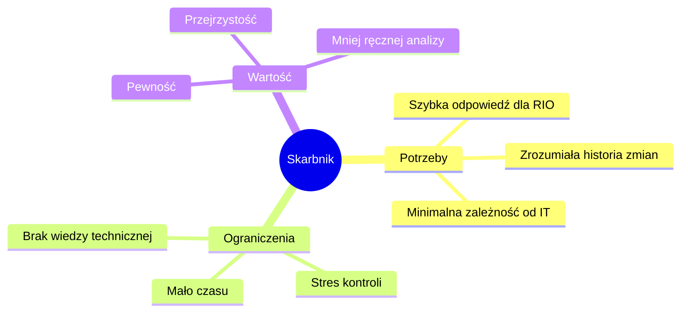

# 01. Problem Discovery

## Sytuacja

Skarbnik otrzymał zapowiedź kontroli RIO. To oznacza, że ma konkretną potrzebę operacyjną, ograniczony czas i bardzo praktyczne pytanie:

> Potrzebuję historii zmian na umowach, żeby pokazać kto i kiedy co ruszał.

To nie jest abstrakcyjne wymaganie techniczne. To scenariusz pracy przed kontrolą.

---

## Pytania, które prawdopodobnie zada RIO

1. Kto zmienił dane umowy?
2. Kiedy nastąpiła zmiana?
3. Co dokładnie zostało zmienione?
4. Czy zmiana dotyczyła umowy, aneksu, faktury, pliku czy harmonogramu?
5. Czy widać pełną sekwencję zdarzeń?
6. Czy można wskazać osobę odpowiedzialną za zmianę?
7. Czy zmiany były pojedyncze, czy wynikały z większej operacji biznesowej?

---

## Obecny problem użytkownika

Techniczny `AuditLog` zwykle jest trudny do odczytania dla użytkownika biznesowego:

- zawiera nazwy techniczne encji,
- może pokazywać wiele rekordów dla jednej operacji,
- nie grupuje zdarzeń w logiczną historię,
- wymaga znajomości modelu danych,
- nie odpowiada bezpośrednio na pytanie kontrolera.

---

## Job To Be Done

> Kiedy przygotowuję się do kontroli RIO, chcę szybko zobaczyć historię zmian na umowie, abym mógł wiarygodnie wyjaśnić kto, kiedy i co zmienił.

---

## Zakładany użytkownik

Główny użytkownik MVP:

---

## Najważniejszy insight

Skarbnik nie chce analizować logów. Skarbnik chce mieć **narrację o zmianach**.

Dlatego MVP powinno być projektowane jako narzędzie do odpowiedzi na pytanie biznesowe, a nie jako techniczna przeglądarka tabeli.

[Previous](00-executive-summary.md) | [Next](02-user-story-and-journey.md)
