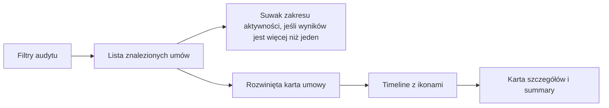
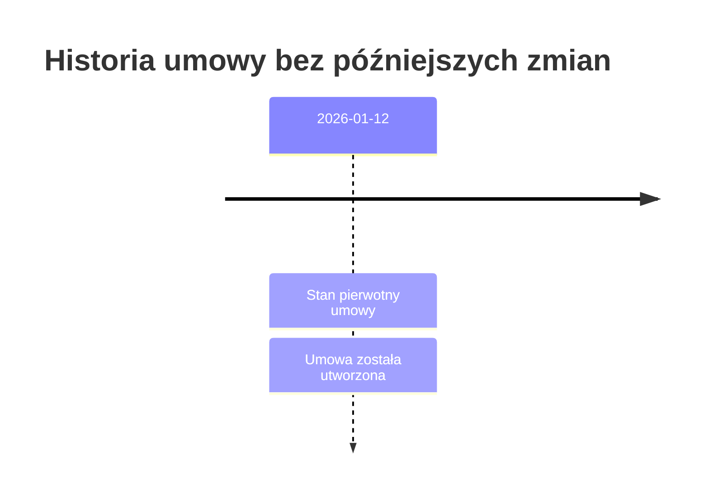
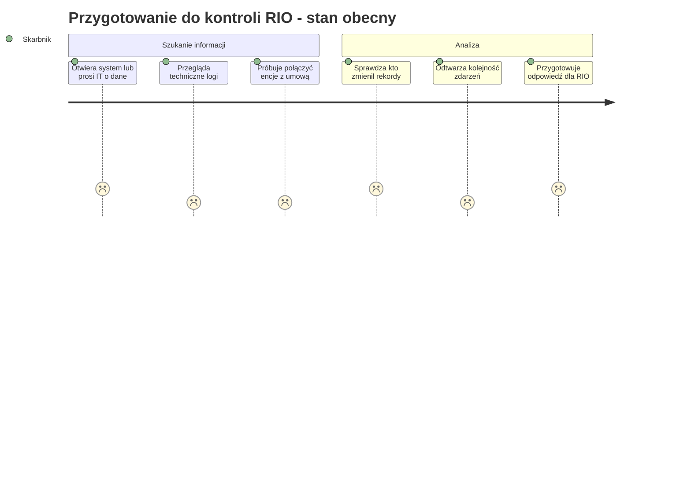
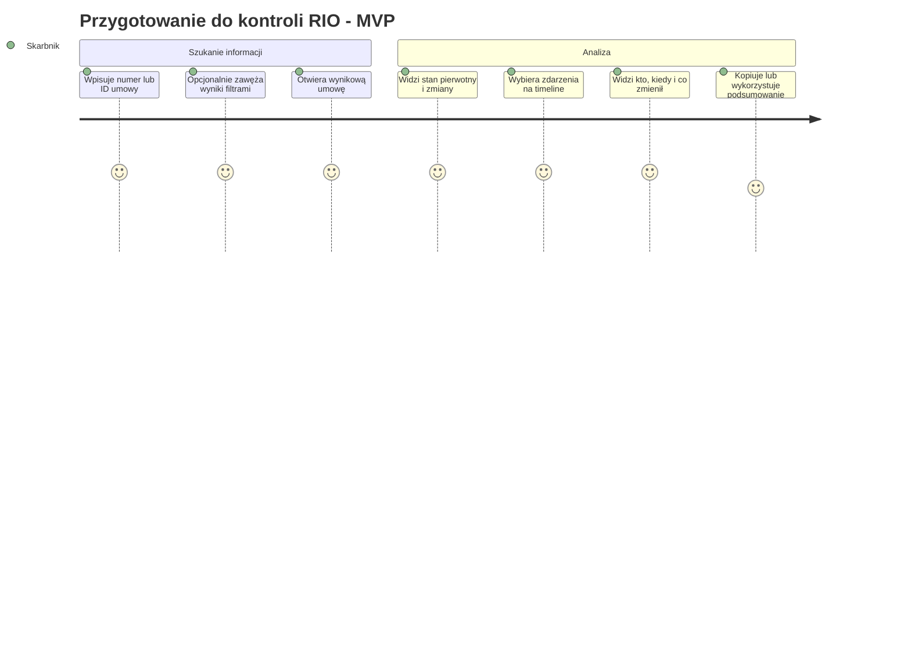
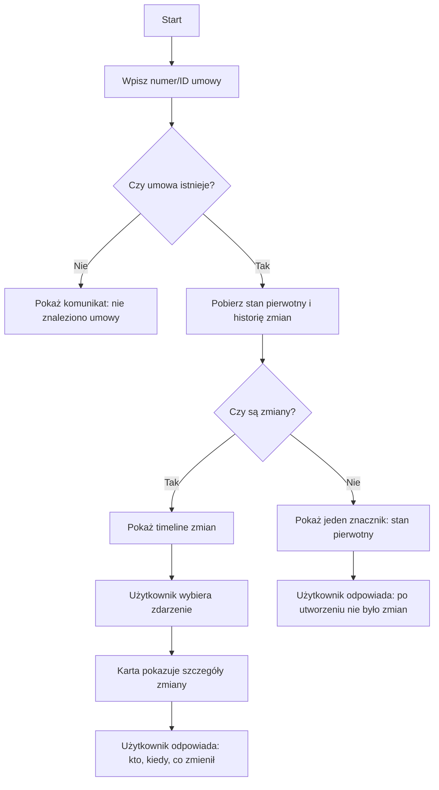
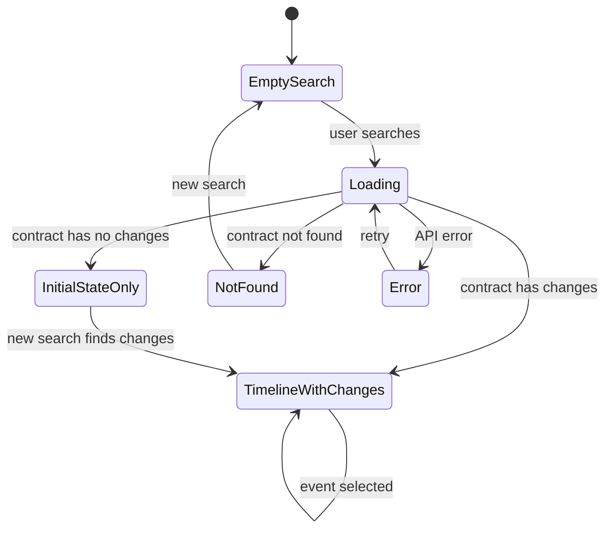
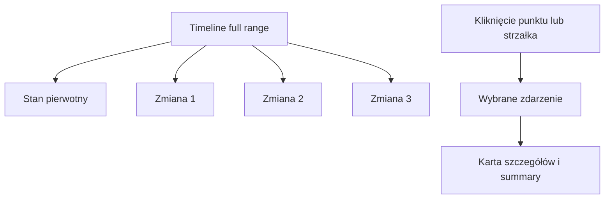

# 02. User Story & Journey

## Główna user story

> Jako skarbnik przygotowujący się do kontroli RIO, chcę zobaczyć historię zmian na umowie w czytelnej formie, aby móc szybko odpowiedzieć kto, kiedy i co zmienił.

---

## Acceptance Criteria

1. Użytkownik może podać identyfikator lub numer umowy.
2. System pokazuje chronologiczną historię zmian na timeline.
3. Każda zmiana zawiera:
   - datę,
   - użytkownika,
   - typ zmiany,
   - typ obiektu,
   - starą i nową wartość, jeśli dotyczy.
4. Nazwy techniczne encji są zastąpione nazwami biznesowymi.
5. Użytkownik może wybrać zdarzenie na timeline ikoną lub przejść między zdarzeniami strzałkami.
6. Punkty timeline mają tooltipy opisujące, jaką akcję reprezentują.
7. Sekcja użytkowników pokazuje, jakich akcji na umowie dotyczyły wpisy danego użytkownika.
8. Użytkownik może zawęzić wyniki po dacie, typie zmiany, typie obiektu i użytkowniku.
9. Po użyciu filtrów system pokazuje znalezione umowy jako klikalne karty.
10. Jeżeli filtry zwrócą więcej niż jedną umowę, system pokazuje suwak zakresu aktywności.
11. Użytkownik może rozwinąć wiele kart umów naraz i porównać ich szczegóły bez opuszczania wyników.
12. Jeżeli umowa nie posiada zmian, system nie pokazuje pustego widoku, tylko jeden znacznik na timeline reprezentujący stan pierwotny / utworzenie umowy.
13. System pokazuje czytelny komunikat po polsku, jeśli wystąpi błąd.
14. Użytkownik może na podstawie widoku odpowiedzieć:
    - kto zmienił,
    - kiedy zmienił,
    - co zmienił,
    - albo że po utworzeniu umowy nie było dalszych zmian.

---

## Jak łączymy karuzelę zdarzeń z suwakiem zakresu czasu?

Karuzela zdarzeń pozostaje podstawowym sposobem pracy na timeline jednej umowy, bo użytkownik musi szybko zrozumieć konkretną zmianę.

Suwak zakresu czasu ma inny cel: zawęża listę znalezionych umów po zastosowaniu filtrów. Dlatego pojawia się tylko wtedy, gdy:

- użytkownik zastosował co najmniej jeden filtr audytu,
- wynik zawiera więcej niż jedną umowę.

To rozdziela dwa tryby pracy:

- lista wyników pomaga znaleźć właściwą umowę,
- rozwinięte karty umów pokazują timeline, aktywne zdarzenie i summary; przy jednej akcji oś timeline nie jest renderowana.

---

## Dlaczego pokazuję stan pierwotny, gdy nie było zmian?

Brak zmian też jest informacją dla skarbnika.

Pusty widok może być niejednoznaczny:

- czy system nie znalazł danych?
- czy wystąpił błąd?
- czy naprawdę nic nie zmieniano?

Dlatego jeśli umowa istnieje, ale nie ma późniejszych zmian, timeline pokazuje jeden znacznik:

> Stan pierwotny umowy / utworzenie umowy.

Dzięki temu skarbnik może jasno odpowiedzieć:

> Po utworzeniu umowy nie odnotowano dalszych zmian w wybranym zakresie.

---

## User Journey: stan obecny

---

## User Journey: MVP

---

## Minimalny przepływ użytkownika

---

## Stany widoku

---

## Timeline z wyborem zdarzenia

---

## Wartość dla skarbnika

| Element | Wartość |
|---|---|
| Timeline | Pokazuje historię jako sekwencję zdarzeń |
| Karuzela zdarzeń | Pozwala szybko przejść do konkretnej zmiany |
| Filtry | Pozwalają znaleźć umowy z konkretnym typem aktywności |
| Suwak wyników | Zawęża listę umów tylko wtedy, gdy po filtrach jest więcej niż jeden wynik |
| Klikalne karty umów | Pozwalają rozwinąć jedną lub wiele umów bez opuszczania wyników |
| Tooltipy na ikonach | Wyjaśniają, co reprezentuje punkt timeline |
| Stan pierwotny | Usuwa niejednoznaczność pustego widoku |
| Etykiety biznesowe | Użytkownik nie musi znać nazw technicznych |
| Summary z akcjami użytkowników | Daje szybki obraz skali zmian i odpowiedzialności |

---

## Dlaczego timeline, a nie tabela?

Tabela pokazuje rekordy. Timeline pokazuje przebieg zdarzeń.

W kontekście kontroli ważna jest kolejność i zrozumienie historii, a nie tylko lista wierszy.

Karuzela zdarzeń wzmacnia ten model, bo użytkownik pracuje na osi czasu i od razu widzi szczegóły wybranej zmiany.

[Previous](01-problem-discovery.md) | [Next](03-opportunity-solution-tree.md)
