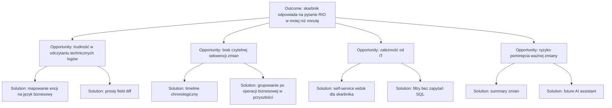

# 03. Opportunity Solution Tree

## Cel biznesowy

Skrócić czas przygotowania odpowiedzi dla RIO dotyczącej historii zmian na umowie.

---

## Opportunity Solution Tree

---

## Wybrane rozwiązania do MVP

| Problem | Rozwiązanie MVP | Dlaczego teraz |
|---|---|---|
| Techniczne nazwy encji | Mapowanie na nazwy biznesowe | Szybka poprawa zrozumiałości |
| Brak narracji | Timeline | Lepiej odpowiada na pytanie „co wydarzyło się po kolei?” |
| Zbyt wiele danych | Filtry | Skarbnik może ograniczyć zakres kontroli |
| Brak szybkiego obrazu sytuacji | Deterministyczne summary | Ułatwia orientację przed wejściem w szczegóły |

---

## Rozwiązania odłożone na później

| Pomysł | Dlaczego nie w MVP |
|---|---|
| AI Summary | Najpierw potrzebujemy wiarygodnych i deterministycznych danych |
| Export PDF | Przydatny produkcyjnie, ale niepotrzebny do walidacji hipotezy |
| Cross-module audit | Nie ma jeszcze wielu modułów jako źródeł |
| GraphQL | Use case jest zbyt wąski |
| Event Sourcing | Koszt wdrożenia większy niż wartość dla próbki MVP |

---

## Najważniejsza decyzja

MVP optymalizuje **czas dojścia do odpowiedzi**, nie kompletność platformy.

[Previous](02-user-story-and-journey.md) | [Next](04-mvp-definition.md)
