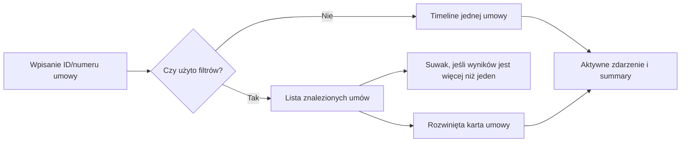
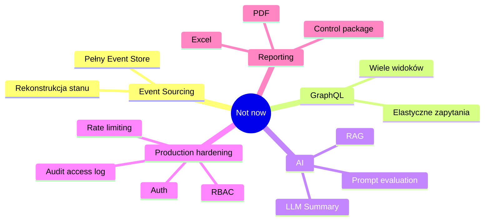

# 04. MVP Definition

## Definicja MVP

MVP to najmniejsze rozwiązanie, które pozwala sprawdzić, czy skarbnik potrafi samodzielnie i szybko znaleźć historię zmian na umowie.

---

## MVP nie jest

- produkcyjną platformą audytową,
- kompletnym systemem compliance,
- rozwiązaniem dla wszystkich modułów,
- implementacją docelowej architektury,
- demonstracją maksymalnej liczby technologii.

---

## Zakres funkcjonalny

---

## Funkcje w MVP

1. Pobranie zmian dla jednej umowy.
2. Prezentacja jako timeline.
3. Mapowanie typów encji:
   - `ContractHeaderEntity` -> `Umowa`,
   - `AnnexHeaderEntity` -> `Aneks`,
   - `PaymentScheduleEntity` -> `Harmonogram płatności`,
   - `InvoiceEntity` -> `Faktura`,
   - `FileEntity` -> `Plik`,
   - `ContractFundingEntity` -> `Finansowanie`.
4. Nawigacja po zdarzeniach:
   - kliknięcie punktu timeline,
   - strzałki poprzednie/następne,
   - tooltipy wyjaśniające ikony.
5. Summary:
   - liczba zmian,
   - liczba osób,
   - liczba dodanych/usuniętych/zmodyfikowanych elementów,
   - użytkownicy wraz z akcjami na umowie.
6. Filtrowanie po dacie, typie zmiany, typie encji i użytkowniku.
7. Lista znalezionych umów po zastosowaniu filtrów.
8. Warunkowy suwak zakresu aktywności, widoczny tylko dla przefiltrowanych wyników z więcej niż jedną umową.
9. Rozwijane karty wyników, które pokazują timeline i pełne dane wybranej umowy.

---

## Poza zakresem MVP

---

## Kryterium „wystarczająco dobre”

MVP jest wystarczające, jeżeli:

- użytkownik znajduje potrzebną historię,
- rozumie wynik,
- potrafi wskazać osobę, czas i zakres zmiany,
- nie musi prosić IT o interpretację technicznych logów.

[Previous](03-opportunity-solution-tree.md) | [Next](05-success-metrics.md)
