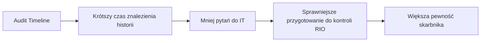

# 05. Success Metrics

## Dlaczego metryki są ważne?

Samo wdrożenie funkcjonalności nie oznacza sukcesu. Sukcesem jest dopiero to, że skarbnik szybciej i pewniej odpowiada na pytania RIO.

---

## Główna metryka sukcesu

> Czas potrzebny skarbnikowi na znalezienie odpowiedzi „kto, kiedy i co zmienił?” dla konkretnej umowy.

---

## Metryki MVP

| Metryka | Cel MVP | Dlaczego ważne |
|---|---:|---|
| Czas znalezienia historii zmian | < 1 minuta | Bezpośrednio mierzy wartość dla skarbnika |
| Liczba kliknięć | <= 4 | Pokazuje prostotę rozwiązania |
| Zrozumiałość bez pomocy IT | Tak | Skarbnik powinien działać samodzielnie |
| Liczba błędnych interpretacji | 0 w teście próbki | Kontrola wymaga wiarygodności |
| Czas do pierwszej użytecznej informacji | < 10 sekund | Ważne przy stresie kontroli |

---

## Product metrics po wdrożeniu

| Metryka | Interpretacja |
|---|---|
| Liczba użyć widoku audit timeline | Czy funkcja jest używana |
| Najczęściej używane filtry | Co jest najważniejsze dla użytkowników |
| Czas sesji | Czy użytkownik szybko znajduje odpowiedź |
| Liczba pustych wyników | Czy użytkownicy wiedzą czego szukają |
| Liczba zgłoszeń do IT o historię zmian | Czy funkcja zmniejsza zależność od IT |

---

## Technical metrics

| Metryka | Cel |
|---|---|
| API latency P95 | < 500 ms dla typowego zapytania |
| Error rate | < 1% |
| Availability | 99.9% w produkcyjnym wariancie |
| Query timeout count | Blisko 0 |
| Log completeness | 100% wpisów dla wspieranego źródła |

---

## Success Metrics Flow

---

## Jak przetestowałbym metryki?

1. Wybrałbym 3-5 przykładowych umów.
2. Poprosiłbym użytkownika o znalezienie:
   - kto zmienił wartość umowy,
   - kiedy dodano aneks,
   - kto usunął plik,
   - czy zmieniano harmonogram.
3. Zmierzyłbym czas i liczbę kliknięć.
4. Porównałbym wynik z obecnym sposobem pracy.

---

## Najważniejsza zasada

Nie mierzę liczby wyświetleń jako głównego sukcesu. Mierzę, czy użytkownik szybciej wykonuje realne zadanie.

[Previous](04-mvp-definition.md) | [Next](06-solution-approach.md)
