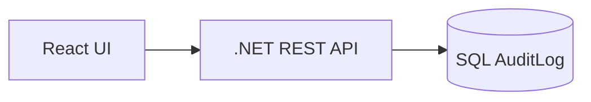
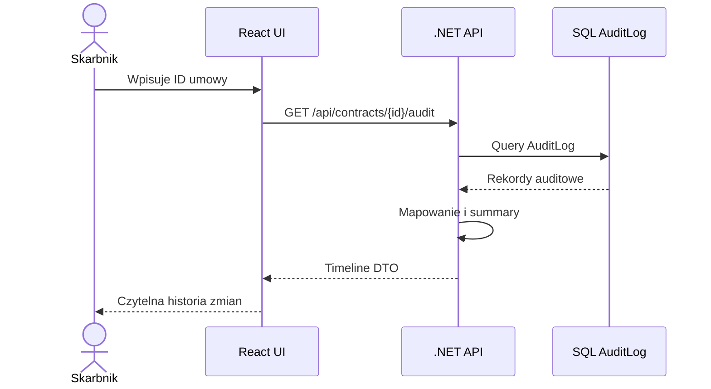
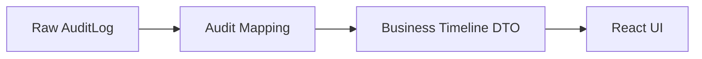

# 06. Solution Approach

## Podejście

W MVP wybieram prostą architekturę:

To rozwiązanie jest wystarczające, aby zbudować pierwszy użyteczny widok i zweryfikować hipotezę MVP.

---

## Główne komponenty

### React UI

Odpowiada za:

- formularz wyszukiwania umowy,
- timeline,
- wybór zdarzenia na osi czasu,
- tooltipy i kartę szczegółów zdarzenia,
- summary z akcjami użytkowników,
- empty/error states.

### .NET API

Odpowiada za:

- pobranie danych z AuditLog,
- mapowanie danych technicznych na DTO dla UI,
- filtrowanie,
- sortowanie,
- przygotowanie summary.

### SQL AuditLog

W MVP traktowany jako istniejące źródło prawdy dla historii zmian.

---

## Flow danych

---

## Dlaczego REST?

REST lepiej pasuje do MVP, bo przypadek użycia jest prosty i dobrze zdefiniowany.

GraphQL zostaje świadomie odłożony na przyszłość, jeśli pojawią się różne perspektywy audytu i bardziej elastyczne zapytania.

---

## Dlaczego nie pełny Event Sourcing teraz?

AuditLog odpowiada na pytanie:

> kto, kiedy i co zmienił?

Event Sourcing odpowiada na szersze pytanie:

> czy cały stan systemu można odtworzyć ze zdarzeń?

W MVP skarbnik potrzebuje audytu, a nie pełnej rekonstrukcji stanu domeny.

---

## Warstwa antykorupcyjna

Nawet w MVP nie chcę, żeby UI zależało od technicznych szczegółów tabeli AuditLog.

Dlatego API zwraca model biznesowy:

To pozwala w przyszłości podmienić SQL AuditLog na event-driven projection bez przepisywania frontendu.

[Previous](05-success-metrics.md) | [Next](07-api-contract.md)
