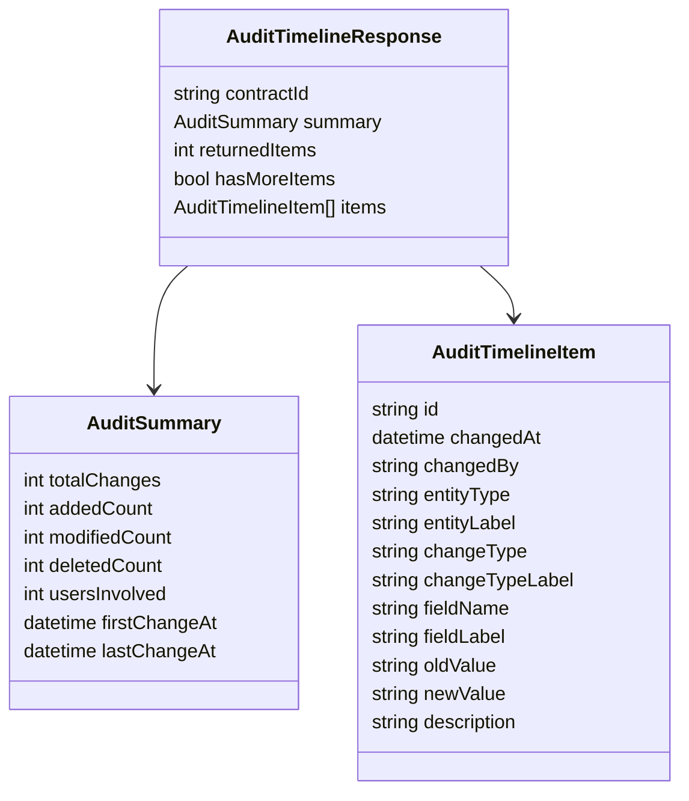

# 07. API Contract

## Cel API

API ma zwrócić historię zmian dla konkretnej umowy w formie gotowej do prezentacji użytkownikowi.

Nie zwracam surowych rekordów `AuditLog`, bo wtedy frontend musiałby znać techniczny model danych.

---

## Endpoint szczegółów umowy

```http
GET /api/contracts/{contractId}/audit
```

### Query parameters

| Parametr | Typ | Wymagany | Opis |
|---|---|---|---|
| `from` | date | nie | Początek zakresu dat |
| `to` | date | nie | Koniec zakresu dat |
| `changeType` | enum | nie | Added, Modified, Deleted |
| `entityType` | enum | nie | Typ encji |
| `user` | string | nie | Filtrowanie po użytkowniku |

---

## Przykład requestu

```http
GET /api/contracts/123/audit?from=2026-01-01&to=2026-12-31&changeType=Modified
```

---

## Endpoint wyszukiwania umów po filtrach audytu

```http
GET /api/contracts/audit-search
```

### Query parameters

| Parametr | Typ | Wymagany | Opis |
|---|---|---|---|
| `contractId` | string | nie | Fragment ID albo numeru umowy |
| `from` | date | nie | Początek zakresu dat |
| `to` | date | nie | Koniec zakresu dat |
| `changeType` | enum | nie | Added, Modified, Deleted |
| `entityType` | enum | nie | Typ encji |
| `user` | string | nie | Filtrowanie po użytkowniku |

Endpoint zwraca maksymalnie 50 umów pasujących do filtrów. Każda karta wyniku zawiera dane umowy i summary policzone dla przefiltrowanych wpisów audytu.

### Przykład odpowiedzi

```json
{
  "totalContracts": 2,
  "returnedContracts": 2,
  "hasMoreContracts": false,
  "contracts": [
    {
      "contractId": "456",
      "contractNumber": "UM-2026-002",
      "summary": {
        "totalChanges": 2,
        "addedCount": 0,
        "modifiedCount": 2,
        "deletedCount": 0,
        "usersInvolved": 2,
        "firstChangeAt": "2026-05-07T11:20:00Z",
        "lastChangeAt": "2026-05-09T15:40:00Z"
      }
    }
  ]
}
```

---

## Przykład odpowiedzi

```json
{
  "contractId": "123",
  "summary": {
    "totalChanges": 8,
    "addedCount": 2,
    "modifiedCount": 5,
    "deletedCount": 1,
    "usersInvolved": 3,
    "firstChangeAt": "2026-01-12T09:15:00",
    "lastChangeAt": "2026-06-18T14:30:00"
  },
  "returnedItems": 8,
  "hasMoreItems": false,
  "items": [
    {
      "id": "audit-001",
      "changedAt": "2026-06-18T14:30:00",
      "changedBy": "anna.nowak",
      "entityType": "PaymentScheduleEntity",
      "entityLabel": "Harmonogram płatności",
      "changeType": "Modified",
      "changeTypeLabel": "Modyfikacja",
      "fieldName": "DueDate",
      "fieldLabel": "Termin płatności",
      "oldValue": "2026-07-01",
      "newValue": "2026-07-15",
      "description": "Zmieniono termin płatności z 2026-07-01 na 2026-07-15"
    }
  ]
}
```

---

## Model odpowiedzi



---

## Error responses

| Status | Kiedy |
|---|---|
| 400 | Nieprawidłowe filtry |
| 404 | Nie znaleziono umowy lub historii |
| 500 | Błąd po stronie API |

---

## Dlaczego API zwraca etykiety biznesowe?

Wartością dla skarbnika jest zrozumienie historii, nie znajomość nazw klas.

Dlatego API może zwrócić zarówno techniczny `entityType`, jak i użytkowy `entityLabel`.

## Dlaczego response zawiera `returnedItems` i `hasMoreItems`?

Historia audytu może być długa. MVP zwraca ograniczony zestaw najnowszych wpisów, ale nie ukrywa tego przed UI.

`summary.totalChanges` opisuje cały przefiltrowany wynik, a `returnedItems` mówi, ile wpisów faktycznie trafiło do timeline. Jeśli `hasMoreItems = true`, UI informuje, że pokazuje tylko najnowsze wpisy.

Filtry są dostępne w UI. Gdy użytkownik zastosuje filtry, frontend korzysta z `GET /api/contracts/audit-search`, pokazuje karty znalezionych umów, a po rozwinięciu karty pobiera szczegóły przez `GET /api/contracts/{contractId}/audit` z tym samym zestawem filtrów.

[Previous](06-solution-approach.md) | [Next](08-ui-concept.md)
