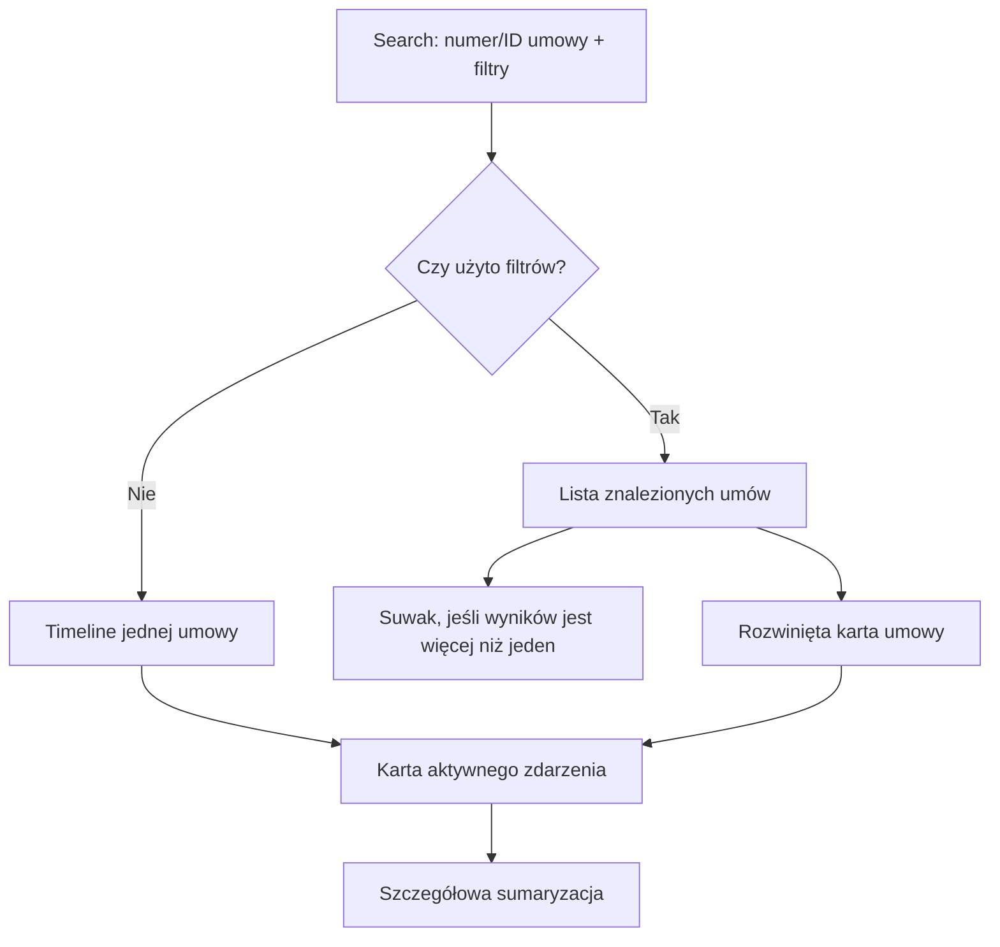
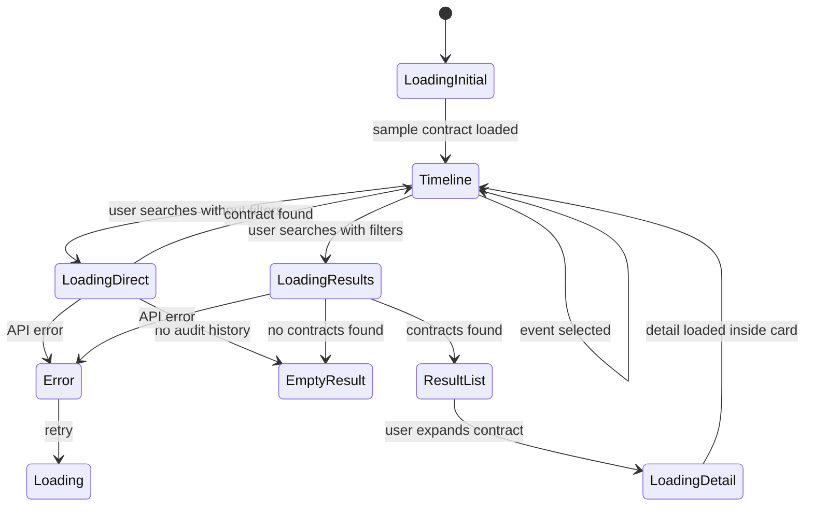

# 08. UI Concept

## Cel UI

UI ma pomóc skarbnikowi szybko zrozumieć historię zmian.

Priorytetem jest czytelność, szybkie przejście do konkretnej umowy i odpowiedź na pytanie:

> Kto, kiedy i co zmienił?

---

## Główny widok

Aktualny MVP ma jeden ekran roboczy:



UI nie pokazuje osobnego badge'a API key. Zabezpieczenie nagłówkiem `X-Audit-Api-Key` pozostaje detalem technicznym środowiska lokalnego.

---

## Aktualny layout

```text
+------------------------------------------------------+
| Audit Timeline MVP                                   |
| Historia zmian na umowie                             |
+------------------------------------------------------+
| Numer / ID umowy: [123________________] [Szukaj]     |
| Filtry: data od/do, typ zmiany, obiekt, użytkownik   |
+------------------------------------------------------+
| Wyniki po filtrach                                   |
| [UM-2026-002] [Zmiany: 2] [Użytkownicy: 2] [v]       |
| [UM-2026-001] [Zmiany: 3] [Użytkownicy: 2] [v]       |
| Suwak zakresu aktywności - tylko gdy wyników > 1     |
+------------------------------------------------------+
| Timeline zdarzeń umowy                               |
|                                                      |
|  12.01.2026  o----o----o----o----o----o 18.06.2026  |
|              ^ tooltip po hover/focus                |
|                                                      |
| [<]  Aktywne zdarzenie                         [>]   |
|      18.06.2026, 14:30                              |
|      Zmieniono termin płatności z ... na ...         |
|      Użytkownik: anna.nowak                          |
|      Akcja: Zmieniono: Harmonogram płatności - ...   |
|      Obiekt: Harmonogram płatności                   |
|      Pole: Termin płatności                          |
|      2026-07-01  ->  2026-07-15                      |
+------------------------------------------------------+
| Sumaryzacja                                          |
| Wszystkie zmiany | Modyfikacje | Dodania | ...       |
|                                                      |
| Użytkownicy                                          |
| anna.nowak                                           |
| - Zmieniono: Harmonogram płatności - Termin ...      |
| - Zmieniono: Faktura - Numer faktury                 |
|                                                      |
| Modyfikacje / Dodano / Usunięto                      |
+------------------------------------------------------+
```

---

## Zachowanie timeline

- Bez filtrów użytkownik widzi bezpośrednio timeline wpisanej umowy.
- Po zastosowaniu filtrów użytkownik widzi listę znalezionych umów.
- Karta wyniku jest klikalna; po rozwinięciu pod spodem pokazuje timeline i szczegóły tej umowy.
- Suwak zakresu aktywności pojawia się tylko wtedy, gdy filtry zwróciły więcej niż jedną umowę.
- Każdy punkt timeline jest przyciskiem wyboru zdarzenia.
- Ikona punktu odpowiada typowi lub obiektowi zdarzenia, np. dodanie, usunięcie, faktura, plik, finansowanie.
- Po hoverze lub focusie punkt pokazuje tooltip z opisem akcji.
- Strzałki obok karty pozwalają przejść do poprzedniego lub następnego zdarzenia.
- Karta aktywnego zdarzenia pokazuje datę, opis, użytkownika, akcję, obiekt, pole oraz przejście wartości `oldValue -> newValue`.

---

## Summary

Sekcja sumaryzacji pokazuje:

- liczniki zmian,
- zakres dat historii,
- użytkowników wraz z akcjami, których dokonali,
- listy modyfikacji, dodań i usunięć.

Summary jest deterministyczne. Nie używa LLM i nie dopowiada faktów spoza timeline.

---

## Empty state

Jeżeli nie znaleziono historii:

> Nie znaleziono historii zmian

To jest ważniejsze niż pusta tabela, bo użytkownik musi wiedzieć, czy to błąd, czy rzeczywiście brak danych.

Jeżeli umowa istnieje, ale nie ma późniejszych zmian, backend zwraca stan pierwotny jako pojedynczy element timeline.

---

## Error state

Jeżeli API jest niedostępne:

> Nie udało się połączyć z API. Sprawdź, czy backend jest uruchomiony.

Jeżeli API zwraca błąd walidacji, UI pokazuje pierwszy konkretny komunikat walidacyjny z odpowiedzi API, np.:

> Data musi mieć format yyyy-MM-dd albo poprawny format ISO.

W produkcji dodałbym correlation id błędu.

---

## UI flow



---

## Dlaczego timeline, a nie tabela?

| Timeline | Tabela |
|---|---|
| Lepiej pokazuje kolejność zdarzeń | Lepiej pokazuje dużo danych naraz |
| Bardziej naturalny dla historii kontroli | Bardziej techniczny |
| Ułatwia narrację dla RIO | Wymaga większej interpretacji |

W MVP wybieram timeline, bo skarbnik potrzebuje historii, a nie arkusza danych.

Suwak zakresu czasu nie zastępuje timeline. Jest pomocniczym filtrem listy wyników i pojawia się wyłącznie po zastosowaniu filtrów, gdy znaleziono więcej niż jedną umowę. Timeline oraz karuzela zdarzeń pozostają miejscem analizy konkretnej umowy.

[Previous](07-api-contract.md) | [Next](09-c4-model.md)
