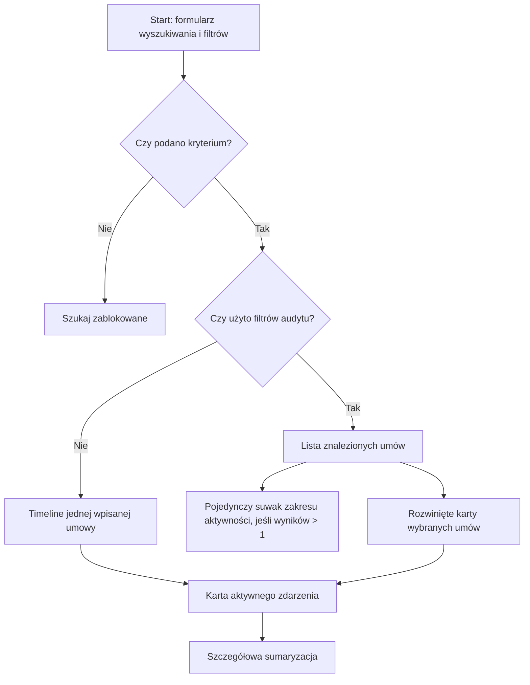
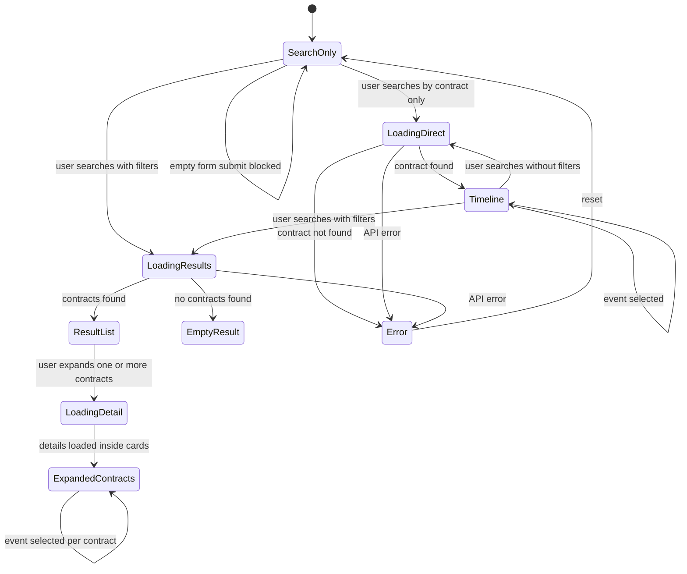

# 08. UI Concept

## Cel UI

UI ma pomóc skarbnikowi szybko zrozumieć historię zmian.

Priorytetem jest czytelność, szybkie przejście do konkretnej umowy i odpowiedź na pytanie:

> Kto, kiedy i co zmienił?

---

## Główny widok

Aktualny MVP ma jeden ekran roboczy:



UI nie pokazuje osobnego badge'a API key. Zabezpieczenie nagłówkiem `X-Audit-Api-Key` pozostaje detalem technicznym środowiska lokalnego.

---

## Aktualny layout

### Stan startowy

```text
+------------------------------------------------------+
| Audit Timeline MVP                                   |
| Historia zmian na umowie                             |
+------------------------------------------------------+
| Numer / ID umowy: [___________________] [Szukaj]     |
| Filtry: data od/do, typ zmiany, obiekt, użytkownik   |
| Szukaj aktywne dopiero po wpisaniu ID/numeru         |
| albo ustawieniu co najmniej jednego filtra            |
+------------------------------------------------------+
```

W stanie startowym nie jest automatycznie ładowana żadna przykładowa umowa.

### Wyniki po zastosowaniu filtrów

```text
+------------------------------------------------------+
| Wyniki                                                |
| Znalezione umowy: 9                                   |
|                                                      |
| Zakres aktywności                                     |
| 16.12.2025 - 04.09.2026                               |
| [jeden suwak z uchwytem Od i uchwytem Do]             |
|                                                      |
| [UM-2026-007] [Zmiany: 6] [Użytkownicy: 5] [v]        |
| [UM-2026-006] [Zmiany: 5] [Użytkownicy: 4] [v]        |
+------------------------------------------------------+
```

### Rozwinięte karty umów

```text
+------------------------------------------------------+
| Wyniki po filtrach                                   |
| [UM-2026-007] [Zmiany: 6] [Użytkownicy: 5] [^]        |
|   Nagłówek otwartej umowy ma wyróżniony kolor         |
+------------------------------------------------------+
| Timeline zdarzeń umowy                               |
|                                                      |
|  12.01.2026  o----o----o----o----o----o 18.06.2026  |
|              ^ tooltip po hover/focus                |
|                                                      |
| [<]  Aktywne zdarzenie                         [>]   |
|      18.06.2026, 14:30                              |
|      Zmieniono termin płatności z ... na ...         |
|      Użytkownik: anna.nowak                          |
|      Akcja: Zmieniono: Harmonogram płatności - ...   |
|      Obiekt: Harmonogram płatności                   |
|      Pole: Termin płatności                          |
|      2026-07-01  ->  2026-07-15                      |
+------------------------------------------------------+
| Sumaryzacja                                          |
| Wszystkie zmiany | Modyfikacje | Dodania | ...       |
|                                                      |
| Użytkownicy                                          |
| anna.nowak                                           |
| - Zmieniono: Harmonogram płatności - Termin ...      |
| - Zmieniono: Faktura - Numer faktury                 |
|                                                      |
| Modyfikacje / Dodano / Usunięto                      |
+------------------------------------------------------+
| [UM-2026-005] [Zmiany: 6] [Użytkownicy: 4] [^]        |
|   Druga umowa może być otwarta równocześnie           |
+------------------------------------------------------+
```

---

## Zachowanie timeline

- Po uruchomieniu strony użytkownik widzi tylko formularz wyszukiwania i filtrów.
- Wyszukiwanie jest zablokowane, dopóki nie wpisano numeru/ID umowy albo nie ustawiono co najmniej jednego filtra.
- Bez filtrów użytkownik widzi bezpośrednio timeline wpisanej umowy.
- Po zastosowaniu filtrów użytkownik widzi listę znalezionych umów.
- Karty wyników są klikalne; użytkownik może otworzyć wiele umów równocześnie.
- Nagłówki otwartych kart mają inny kolor niż zamknięte wyniki, aby łatwo odróżnić rozwinięte umowy.
- Suwak zakresu aktywności pojawia się tylko wtedy, gdy filtry zwróciły więcej niż jedną umowę.
- Zakres dat jest jednym suwakiem z dwoma uchwytami `Od` i `Do`, a nie dwoma osobnymi suwakami.
- Jeżeli umowa ma tylko jedną akcję, UI nie pokazuje osi timeline ani strzałek poprzednie/następne; pokazuje kartę tej akcji i summary.
- Każdy punkt timeline jest przyciskiem wyboru zdarzenia.
- Ikona punktu odpowiada typowi lub obiektowi zdarzenia, np. dodanie, usunięcie, faktura, plik, finansowanie.
- Po hoverze lub focusie punkt pokazuje tooltip z opisem akcji.
- Strzałki obok karty pozwalają przejść do poprzedniego lub następnego zdarzenia.
- Karta aktywnego zdarzenia pokazuje datę, opis, użytkownika, akcję, obiekt, pole oraz przejście wartości `oldValue -> newValue`.

---

## Summary

Sekcja sumaryzacji pokazuje:

- liczniki zmian,
- zakres dat historii,
- użytkowników wraz z akcjami, których dokonali,
- listy modyfikacji, dodań i usunięć.

Summary jest deterministyczne. Nie używa LLM i nie dopowiada faktów spoza timeline.

---

## Empty state

Jeżeli zastosowane filtry nie zwrócą żadnej umowy:

> Nie znaleziono umów

Jeżeli komponent timeline otrzyma pustą listę zdarzeń:

> Nie znaleziono historii zmian

Te komunikaty są ważniejsze niż pusta tabela, bo użytkownik musi wiedzieć, czy to błąd, czy rzeczywiście brak danych.

Jeżeli umowa istnieje, ale nie ma późniejszych zmian, backend zwraca stan pierwotny jako pojedynczy element timeline.

---

## Error state

Jeżeli API jest niedostępne:

> Nie udało się połączyć z API. Sprawdź, czy backend jest uruchomiony.

Jeżeli API zwraca błąd walidacji, UI pokazuje pierwszy konkretny komunikat walidacyjny z odpowiedzi API, np.:

> Data musi mieć format yyyy-MM-dd albo poprawny format ISO.

W produkcji dodałbym correlation id błędu.

---

## UI flow



---

## Dlaczego timeline, a nie tabela?

| Timeline | Tabela |
|---|---|
| Lepiej pokazuje kolejność zdarzeń | Lepiej pokazuje dużo danych naraz |
| Bardziej naturalny dla historii kontroli | Bardziej techniczny |
| Ułatwia narrację dla RIO | Wymaga większej interpretacji |

W MVP wybieram timeline, bo skarbnik potrzebuje historii, a nie arkusza danych.

Suwak zakresu czasu nie zastępuje timeline. Jest pomocniczym filtrem listy wyników i pojawia się wyłącznie po zastosowaniu filtrów, gdy znaleziono więcej niż jedną umowę. Jest jedną osią z dwoma uchwytami zakresu. Timeline oraz karuzela zdarzeń pozostają miejscem analizy konkretnej umowy.

[Previous](07-api-contract.md) | [Next](09-c4-model.md)
