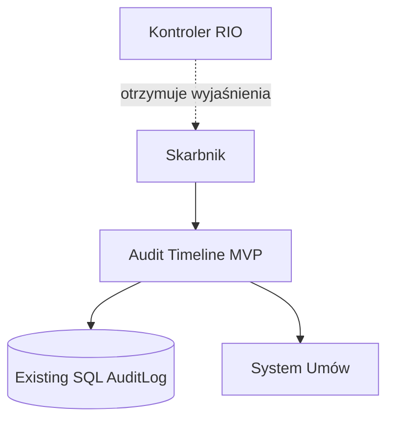
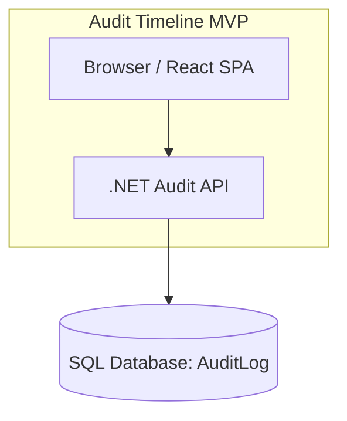
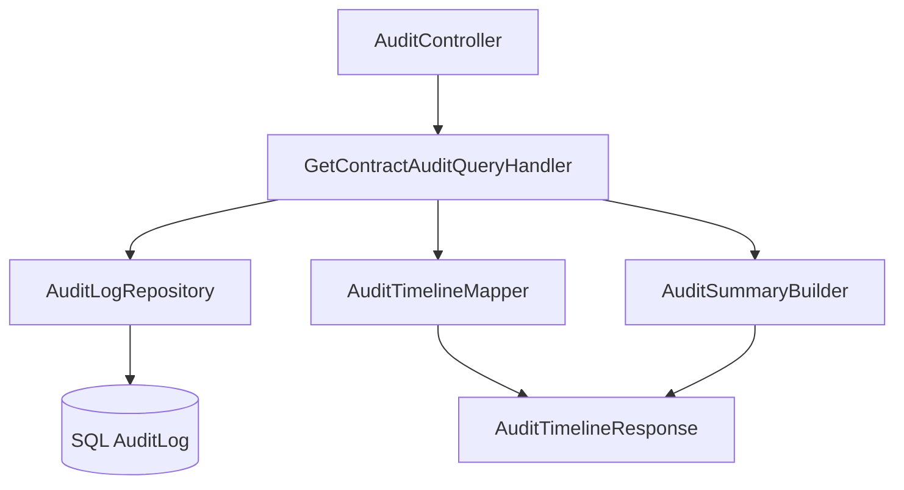
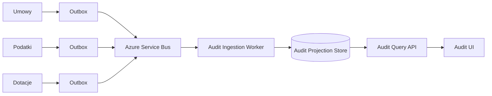

# 09. C4 Model

## C1 - System Context

### Opis

Skarbnik korzysta z Audit Timeline MVP, aby odczytać historię zmian na umowie. Źródłem danych jest istniejący `AuditLog`.

---

## C2 - Container Diagram

### Kontenery

| Kontener | Odpowiedzialność |
|---|---|
| React SPA | Prezentacja timeline, filtrów i summary |
| .NET API | Pobieranie i mapowanie danych audytowych |
| SQL AuditLog | Istniejące źródło danych |

---

## C3 - Component Diagram dla API

### Komponenty

| Komponent | Odpowiedzialność |
|---|---|
| `AuditController` | HTTP contract |
| `GetContractAuditQueryHandler` | przypadek użycia |
| `AuditLogRepository` | odczyt z bazy |
| `AuditTimelineMapper` | mapowanie techniczne -> biznesowe |
| `AuditSummaryBuilder` | budowanie podsumowania |

---

## Przyszły C2 - event-driven audit

---

## Dlaczego nie buduję tego teraz?

Obecnie MVP ma jedno źródło danych. Wydzielenie event-driven platformy teraz zwiększyłoby złożoność bez proporcjonalnej wartości dla skarbnika.

[Previous](08-ui-concept.md) | [Next](10-event-storming.md)
