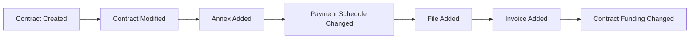
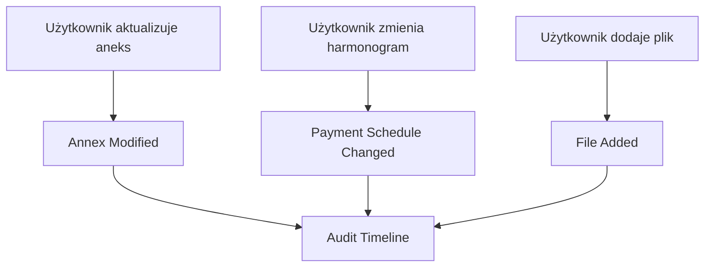

# 10. Event Storming

## Cel

Event Storming pomaga zrozumieć, jakie zdarzenia biznesowe stoją za technicznymi wpisami w AuditLog.

W MVP nie implementuję Event Sourcingu, ale używam myślenia eventowego do zaprojektowania czytelnego timeline.

---

## Możliwe zdarzenia biznesowe

---

## Mapowanie technicznych typów encji

| EntityType | Etykieta biznesowa | Możliwe zdarzenie |
|---|---|---|
| ContractHeaderEntity | Umowa | Utworzono / zmieniono umowę |
| AnnexHeaderEntity | Aneks | Dodano / zmieniono aneks |
| AnnexChangeEntity | Zmiana aneksu | Zmieniono zakres aneksu |
| FileEntity | Plik | Dodano / usunięto plik |
| InvoiceEntity | Faktura | Dodano / zmieniono fakturę |
| PaymentScheduleEntity | Harmonogram płatności | Zmieniono termin / kwotę płatności |
| ContractFundingEntity | Finansowanie | Zmieniono źródło finansowania |

---

## Command -> Event -> Timeline

---

## Co jest ważne dla skarbnika?

Nie nazwa klasy. Nie nazwa tabeli. Nie techniczne ID.

Ważne jest:

- jaki obszar umowy został zmieniony,
- co było przed zmianą,
- co jest po zmianie,
- kto to zrobił,
- kiedy to zrobił.

---

## Wniosek

Event Storming pomaga zaprojektować lepszy język UI, nawet jeśli MVP technicznie nadal czyta z istniejącego AuditLoga.

[Previous](09-c4-model.md) | [Next](11-domain-model.md)
