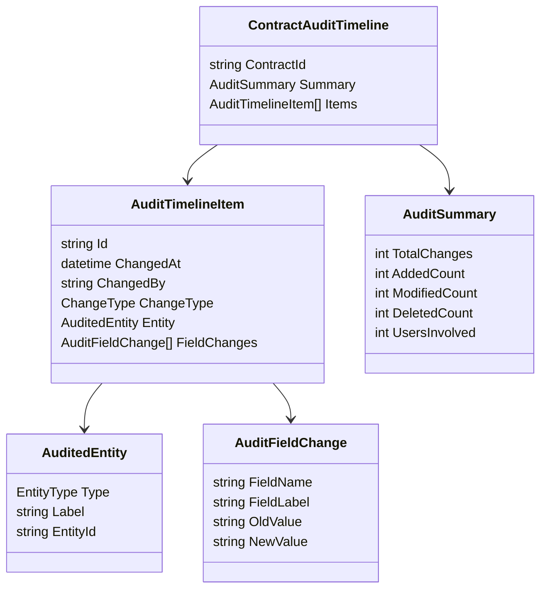
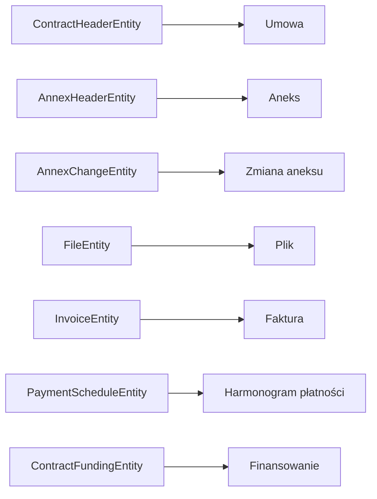

# 11. Domain Model

## Cel modelu domenowego

Model domenowy MVP jest celowo mały. Nie próbuję modelować całego obszaru umów. Modeluję tylko to, co jest potrzebne do odpowiedzi na pytanie RIO.

---

## Kluczowe pojęcia



---

## Enumy z zadania

### Type

```csharp
public enum Type
{
    Added = 1,
    Deleted = 2,
    Modified = 3,
}
```

### EntityType

```csharp
public enum EntityType
{
    Unknown = 0,
    ContractHeaderEntity = 1,
    AnnexHeaderEntity = 2,
    AnnexChangeEntity = 3,
    FileEntity = 4,
    InvoiceEntity = 5,
    PaymentScheduleEntity = 6,
    ContractFundingEntity = 7
}
```

---

## Mapowanie na język użytkownika



---

## Dlaczego model odpowiedzi nie kopiuje tabeli AuditLog?

Ponieważ UI powinno być zależne od potrzeb użytkownika, nie od struktury bazy.

To daje dwie korzyści:

1. Skarbnik dostaje czytelny model.
2. W przyszłości można podmienić źródło danych bez przepisywania UI.

[Previous](10-event-storming.md) | [Next](12-architecture-roadmap.md)
