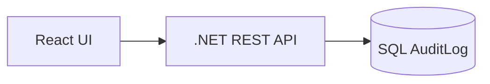
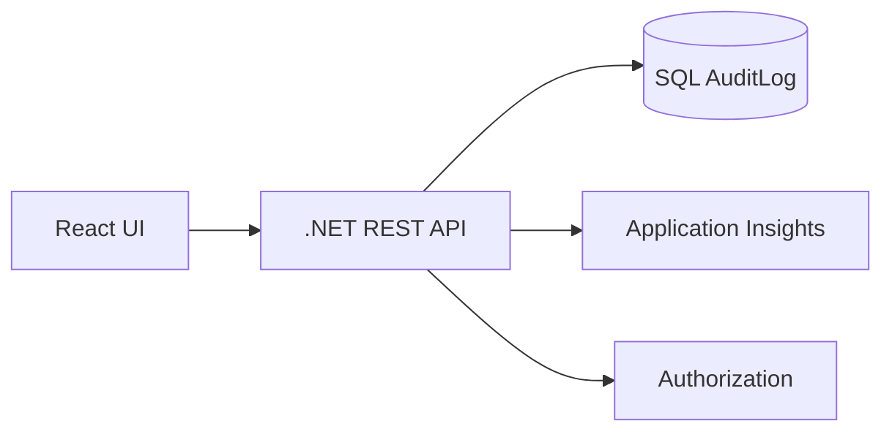
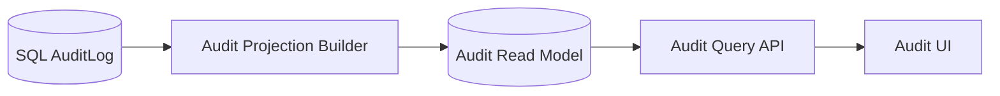
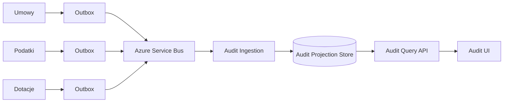
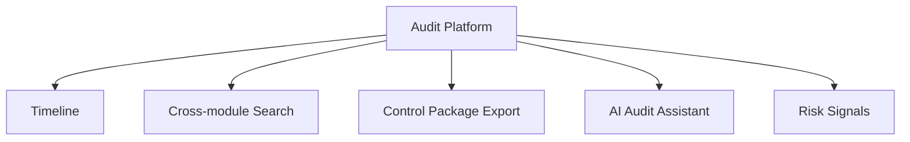
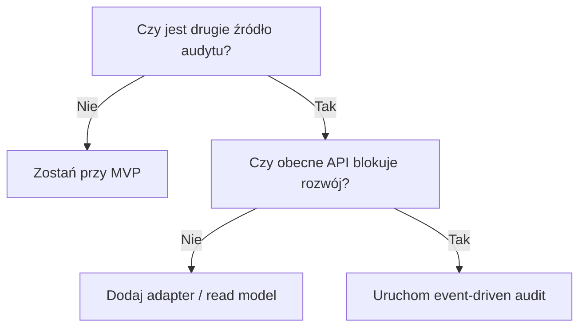

# 12. Architecture Roadmap

## Cel

Pokazać, jak rozwiązanie może ewoluować od prostego MVP do skalowalnej platformy audytowej, bez budowania tej złożoności za wcześnie.

---

## Etap 1 - MVP

### Charakterystyka

- jedno źródło danych,
- jeden główny przypadek użycia,
- szybkie dostarczenie wartości,
- minimum infrastruktury.

---

## Etap 2 - Production Hardening

### Zakres

- autoryzacja,
- monitoring,
- logging strukturalny,
- dashboard,
- podstawowe SLO,
- testy integracyjne,
- obsługa błędów.

---

## Etap 3 - Audit Read Model

### Kiedy?

Gdy zapytania do AuditLog są wolne lub UI potrzebuje modelu bardziej dopasowanego do odczytu.

---

## Etap 4 - Event-driven Audit

### Kiedy?

Gdy pojawią się moduły Podatki i Dotacje oraz audit będzie pochodził z wielu źródeł.

---

## Etap 5 - Audit Platform

### Charakterystyka

- wspólna platforma audytu,
- wiele modułów,
- zaawansowane wyszukiwanie,
- integracja AI,
- raporty dla kontroli,
- analiza ryzyk.

---

## Kiedy uruchamiam zmianę?

Nie teraz. Zmianę uruchamiam dopiero, gdy pojawi się realny trigger:

---

## Najważniejsza zasada

Architektura powinna rosnąć razem z produktem, nie przed produktem.

[Previous](11-domain-model.md) | [Next](13-distributed-consistency.md)
