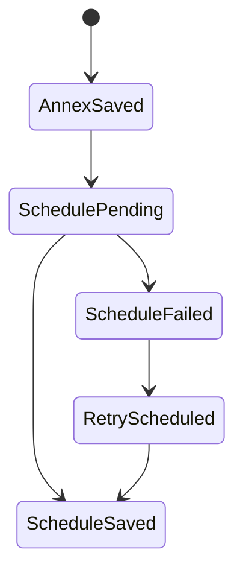
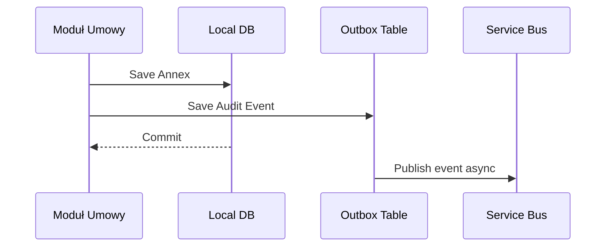
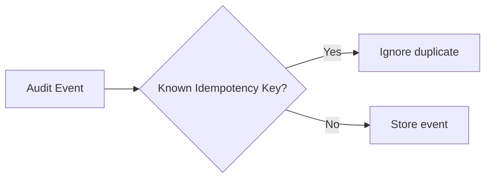
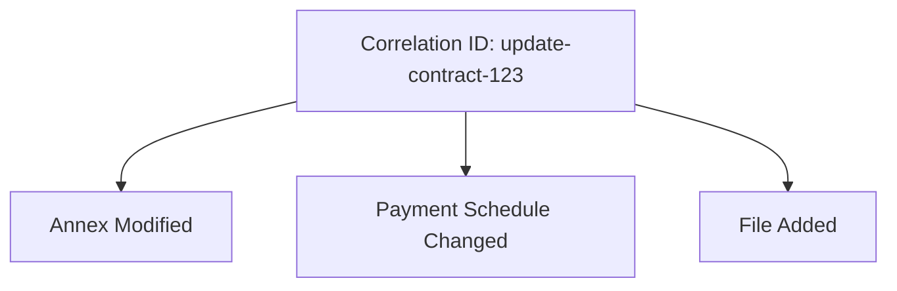
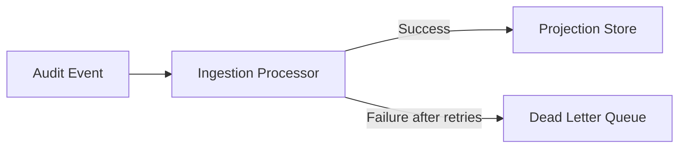

# 13. Distributed Consistency

## Kontekst

Zadanie wspomina, że za 6 miesięcy portfolio modułów może rosnąć o Podatki i Dotacje, a audit przestanie pochodzić z jednej bazy SQL.

W takim świecie nie można zakładać jednej transakcji ACID obejmującej wszystkie moduły.

---

## Przykład problemu

> Aneks został zapisany, ale harmonogram płatności jeszcze nie.

To może oznaczać:

- aneks został zapisany w module Umowy,
- zdarzenie audytowe dla aneksu powstało,
- harmonogram płatności jest przetwarzany asynchronicznie,
- zdarzenie dla harmonogramu pojawi się później,
- albo trafi do obsługi błędów.

---

## Jak to pokazać w audycie?

Nie udajemy pełnej spójności.

Pokazujemy stan procesu:

---

## Mechanizmy

### Outbox Pattern

Zdarzenie audytowe zapisuję w tej samej lokalnej transakcji co zmiana domenowa.

---

### Idempotency Key

Chroni przed podwójnym przetworzeniem tego samego zdarzenia.

---

### Correlation ID

Łączy wiele technicznych zmian w jedną operację biznesową.

---

### Dead Letter Queue

Nie gubimy zdarzeń, których nie udało się przetworzyć.

---

## Co robię w MVP?

W MVP nie implementuję tych mechanizmów.

Opisuję je jako docelowy kierunek, ponieważ obecnie mamy jedno źródło danych i jedno zapytanie odczytowe.

---

## Najważniejsza decyzja

W systemie rozproszonym audit powinien pokazywać prawdę o stanie procesu, nawet jeśli jest on częściowy.

Nie powinien ukrywać niespójności, bo w kontekście kontroli ważniejsza jest wiarygodność niż ładna narracja.

[Previous](12-architecture-roadmap.md) | [Next](14-risk-analysis.md)
