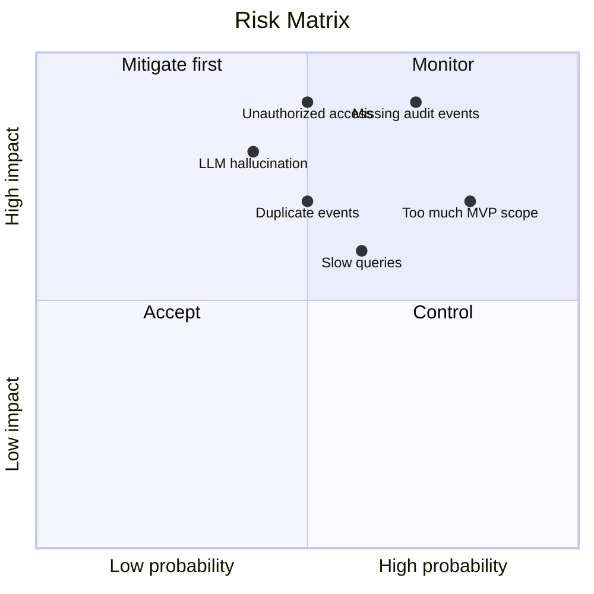

# 14. Risk Analysis

## Cel

Pokazać ryzyka MVP i ryzyka architektury docelowej oraz sposób ich ograniczania.

---

## Macierz ryzyk MVP

| Ryzyko | Wpływ | Prawdopodobieństwo | Mitigacja |
|---|---|---|---|
| AuditLog nie zawiera wystarczających danych | Wysoki | Średnie | Jasne assumptions, empty states, brak ukrywania braków |
| Techniczne nazwy są niezrozumiałe | Średni | Wysokie | Mapowanie na etykiety biznesowe |
| Zapytania są wolne | Średni | Średnie | Filtrowanie, limit wyników, później read model |
| Użytkownik nie zna ID umowy | Średni | Średnie | Po MVP dodać search po numerze/nazwie |
| Brak auth w MVP | Wysoki produkcyjnie | Wysokie | Świadomie poza zakresem próbki, produkcyjny must-have |

---

## Macierz ryzyk docelowych

---

## Największe ryzyko produktowe

Największym ryzykiem nie jest technologia.

Największe ryzyko:

> Zbudujemy poprawny technicznie widok, który nadal nie odpowiada na pytania skarbnika.

Dlatego metryką sukcesu jest czas znalezienia odpowiedzi, nie liczba endpointów.

---

## Największe ryzyko architektoniczne

Największe ryzyko docelowe:

> Brak spójnego modelu audytu między modułami.

Jeśli Umowy, Podatki i Dotacje zaczną emitować różne struktury audytu, późniejsza integracja będzie kosztowna.

Mitigacja:

- wspólny kontrakt `AuditEvent`,
- wersjonowanie eventów,
- correlation id,
- idempotency,
- centralna projekcja.

---

## Największe ryzyko AI

Jeśli w przyszłości dodamy LLM, największym ryzykiem jest halucynacja lub interpretacja niezgodna z danymi.

Mitigacja:

- LLM generuje tylko opis na podstawie deterministycznych danych,
- zawsze pokazujemy źródłowe wpisy,
- prompt evaluation,
- brak generowania faktów spoza audit timeline,
- wyraźne oznaczenie AI summary.

---

## Ryzyko overengineeringu

To zadanie szczególnie łatwo przeinżynierować.

Dlatego świadomie ograniczam MVP i dokumentuję, które rozwiązania mają sens dopiero później.

[Previous](13-distributed-consistency.md) | [Next](15-mvp-validation-plan.md)
