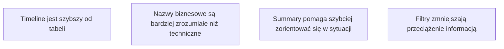
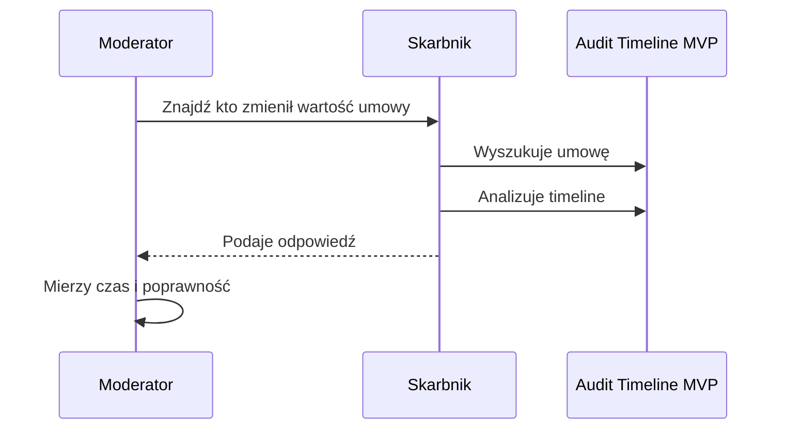

# 15. MVP Validation Plan

## Cel walidacji

Sprawdzić, czy MVP faktycznie pomaga skarbnikowi, zamiast tylko prezentować dane w nowym UI.

---

## Główna hipoteza

> Timeline zmian skraca czas znalezienia odpowiedzi dla RIO w porównaniu do analizy technicznych logów.

---

## Hipotezy szczegółowe

---

## Scenariusz testowy

Użytkownik otrzymuje zadania:

1. Znajdź, kto ostatnio zmienił wartość umowy.
2. Sprawdź, czy dodano aneks.
3. Sprawdź, czy zmieniono harmonogram płatności.
4. Ustal, ile osób modyfikowało umowę.
5. Przygotuj krótką odpowiedź dla RIO.

---

## Dane do pomiaru

| Metryka | Jak mierzyć |
|---|---|
| Czas wykonania zadania | Stoper / telemetry |
| Liczba kliknięć | Event tracking |
| Czy użytkownik znalazł poprawną odpowiedź | Porównanie z danymi źródłowymi |
| Poziom pewności użytkownika | Krótka ankieta 1-5 |
| Liczba pytań do IT | Obserwacja / feedback |

---

## Minimalny test użyteczności

---

## Kryterium pozytywnej walidacji

MVP uznaję za pozytywnie zwalidowane, jeśli:

- 4/5 użytkowników znajduje poprawną odpowiedź bez pomocy,
- średni czas wykonania głównego zadania jest poniżej 1 minuty,
- użytkownicy rozumieją nazwy encji bez wyjaśniania,
- użytkownicy wskazują timeline jako bardziej czytelny niż surowy log.

---

## Co dalej po walidacji?

Jeżeli hipoteza się potwierdzi:

- dodać eksport,
- dodać search,
- dodać production hardening,
- rozpocząć prace nad read model.

Jeżeli hipoteza się nie potwierdzi:

- sprawdzić, czy problemem jest UI,
- sprawdzić, czy brakuje danych,
- wrócić do rozmów z użytkownikami,
- nie rozbudowywać architektury bez potwierdzonej wartości.

[Previous](14-risk-analysis.md) | [Next](16-future-ai-vision.md)
