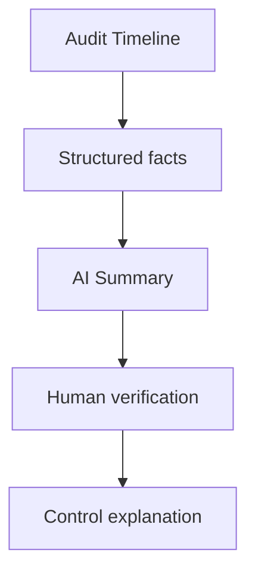
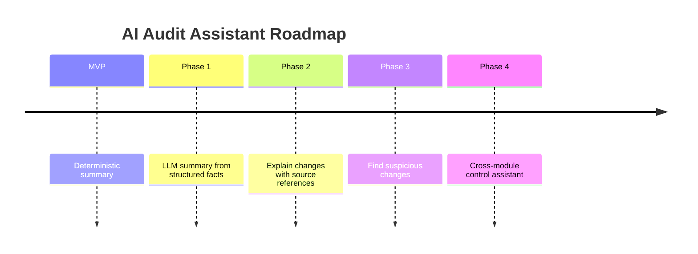

# 16. Future AI Vision

## Dlaczego AI nie jest częścią MVP?

W kontekście kontroli RIO najważniejsza jest wiarygodność.

LLM może pomóc w interpretacji historii zmian, ale nie powinien być pierwszym krokiem, dopóki nie mamy deterministycznego i sprawdzonego modelu danych.

---

## MVP: deterministic summary

W MVP można przygotować proste podsumowanie bez LLM:

```text
W wybranym okresie umowę zmieniono 8 razy.
Zmiany wykonało 3 użytkowników.
Najczęściej zmieniano harmonogram płatności.
Ostatnia zmiana miała miejsce 18.06.2026.
```

To jest bezpieczne, przewidywalne i łatwe do zweryfikowania.

---

## Future: AI Audit Assistant

Docelowo AI mogłoby pomagać skarbnikowi w analizie historii zmian.



---

## Możliwe funkcje AI

| Funkcja | Wartość |
|---|---|
| Wyjaśnij historię zmian prostym językiem | Szybsze przygotowanie do kontroli |
| Wskaż największe zmiany | Ułatwia skupienie na ryzykach |
| Znajdź nietypowe zmiany | Pomaga wychwycić anomalie |
| Przygotuj roboczą odpowiedź dla RIO | Oszczędność czasu |
| Porównaj dwie wersje umowy | Ułatwia analizę skutków |

---

## Roadmapa AI



---

## Zasady bezpieczeństwa AI

1. AI nie może tworzyć faktów spoza danych źródłowych.
2. Każde twierdzenie powinno mieć odniesienie do wpisu auditowego.
3. AI summary nie zastępuje timeline.
4. Użytkownik zawsze widzi dane źródłowe.
5. Prompt evaluation jest częścią procesu.
6. Wrażliwe dane powinny być maskowane zgodnie z uprawnieniami.

---

## Dlaczego to pasuje do produktu?

AI nie jest tu gadżetem.

Może realnie skrócić czas przygotowania odpowiedzi dla RIO, ale dopiero wtedy, gdy dane bazowe są poprawne, kompletne i zrozumiałe.

[Previous](15-mvp-validation-plan.md) | [Next](17-delivery-plan.md)
