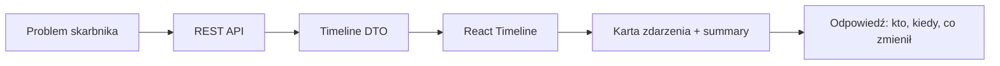
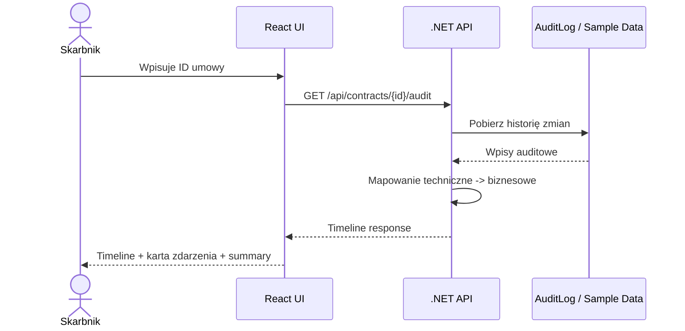
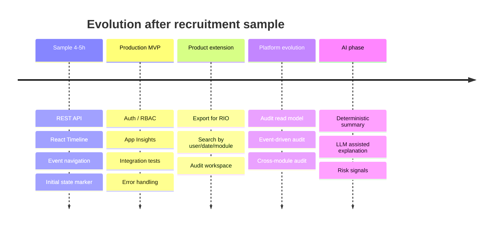
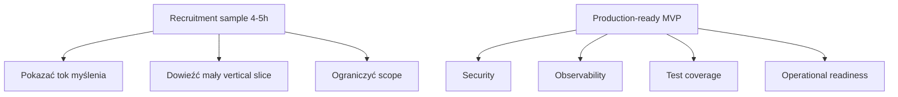

# 17. Delivery Plan

## Cel dokumentu

Ten dokument pokazuje realistyczny plan realizacji zadania w dwóch różnych horyzontach:

1. **Recruitment MVP sample** — zakres na około **4–5 godzin**, zgodny z informacją z procesu rekrutacyjnego.
2. **Production-ready MVP** — zakres, który byłby potrzebny, gdyby rozwiązanie miało zostać przygotowane do realnego użycia w produkcie.

To rozróżnienie jest celowe. W zadaniu rekrutacyjnym najważniejsze jest pokazanie sposobu myślenia, umiejętności cięcia scope’u i dostarczenia małej, użytecznej próbki, a nie zbudowanie kompletnej platformy audytowej.

---

## Timebox

Zadanie traktuję jako **timeboxed recruitment MVP sample** na około **4–5 godzin**.

Moim celem w tym czasie jest pokazanie:

- jak definiuję zakres MVP,
- jak przekładam problem skarbnika na API i UI,
- jak podejmuję decyzje produktowo-techniczne,
- jak odpuszczam rzeczy, które nie są konieczne do walidacji MVP,
- jak myślę o dalszej ewolucji architektury.

Wszystkie elementy wykraczające poza ten timebox opisuję jako świadomie odpuszczone albo jako kierunek rozwoju.

---

## Recruitment MVP sample — plan na 4–5 godzin

| Etap | Zakres | Szacowany czas |
|---|---|---:|
| 1. Problem framing | Doprecyzowanie celu MVP, założeń, głównej hipotezy i zakresu | 30 min |
| 2. Backend API | Jeden endpoint REST, podstawowe DTO, mapowanie danych auditowych na timeline | 75–90 min |
| 3. Data access / sample data | Odczyt z AuditLog, a jeśli struktura danych wymaga więcej analizy — kontrolowany fallback na sample data | 30–45 min |
| 4. Frontend timeline | Search, timeline, pokazanie kto/kiedy/co zmienił, podstawowe states | 75–90 min |
| 5. Event navigation + UX polish | Ikony zdarzeń, tooltipy, strzałki poprzednie/następne i karta aktywnego zdarzenia | 30–45 min |
| 6. Initial state + summary | Jeden znacznik stanu pierwotnego, deterministic summary, akcje użytkowników w podsumowaniu | 30–45 min |
| 7. README / decyzje | 3 decyzje niewymuszone, co odpuściłem, kierunek architektury docelowej | 45–60 min |

**Łącznie:** około **4–5 godzin**.

---

## Zakres oddawanego sample

W sample chcę dowieźć minimalny pionowy przekrój:

---

## Co musi działać w sample

| Element | Czy wymagany w sample? | Dlaczego |
|---|---|---|
| Jeden endpoint REST | Tak | Główne źródło danych dla UI |
| Timeline UI | Tak | Najważniejsza wartość dla skarbnika |
| Mapowanie encji na nazwy biznesowe | Tak | Bez tego widok jest zbyt techniczny |
| Tooltipy i nawigacja zdarzeń | Tak | Ułatwiają zrozumienie ikon i przechodzenie po historii |
| Stan pierwotny, gdy nie było zmian | Tak | Brak zmian też jest informacją |
| Deterministic summary | Tak, proste | Daje szybki obraz sytuacji |
| README z decyzjami | Tak | Zadanie ocenia tok myślenia |
| Pełna integracja produkcyjna z DB | Opcjonalnie | Zależne od czasu i struktury danych |
| Testy | Minimalne / wybrane | Tylko krytyczna logika, jeśli timebox pozwoli |

---

## Co nie powinno wejść do 4–5h sample

| Element | Powód odpuszczenia |
|---|---|
| GraphQL | Use case jest prosty i REST wystarczy |
| Pełny Event Sourcing | Za duży koszt dla MVP sample |
| Mikroserwis auditowy | Brak niezależnego lifecycle w próbce |
| LLM / AI Summary | W audycie najpierw potrzebna jest deterministyczna wiarygodność |
| Eksport PDF / Excel | Przydatne produkcyjnie, ale nie waliduje głównej hipotezy |
| Pełny auth/RBAC | Produkcyjnie konieczne, ale poza zakresem próbki |
| OpenSearch / Azure AI Search | Niepotrzebne przy historii jednej umowy |
| Rozbudowany test suite | W sample wystarczą testy krytycznej logiki lub opis podejścia |

---

## Sample execution flow

---

## Production-ready MVP — orientacyjny plan

Gdyby rozwiązanie miało wejść do realnego produktu, zakres byłby większy niż próbka rekrutacyjna.

| Etap | Zakres | Szacowany czas |
|---|---|---:|
| 1. Analiza danych produkcyjnych | Pełna analiza AuditLog, edge cases, jakość danych | 4–6 h |
| 2. Stabilny backend | Endpointy, walidacja, obsługa błędów, pagination, limity | 6–8 h |
| 3. Produkcyjny frontend | Timeline, filtrowanie zakresu czasu, stany, accessibility, UX polish | 6–10 h |
| 4. Testy | Unit, integration, podstawowe frontend tests | 4–6 h |
| 5. Security & permissions | Auth, RBAC/policy, maskowanie danych | 4–8 h |
| 6. Observability | Structured logs, App Insights, dashboard, correlation id | 3–5 h |
| 7. Dokumentacja | README, ADR, runbook, decyzje | 3–4 h |

**Łącznie production-ready MVP:** około **30–47 godzin**.

Ta estymacja nie dotyczy zadania rekrutacyjnego. To informacja, co byłoby potrzebne przy realnym wdrożeniu produkcyjnym.

---

## Roadmapa po sample

---

## Kryterium zakończenia sample

Sample uznaję za skończony, jeśli osoba oceniająca może uruchomić lub przejrzeć rozwiązanie i zobaczyć:

1. Główne pytanie użytkownika zostało zrozumiane.
2. UI odpowiada na pytanie: kto, kiedy i co zmienił.
3. Zdarzenia można wybierać na timeline i przechodzić między nimi strzałkami.
4. Brak zmian jest pokazany jako stan pierwotny, a nie pusty ekran.
5. Dokumentacja wyjaśnia decyzje i świadome odpuszczenia.
6. Architektura docelowa jest opisana, ale nie została zbudowana przedwcześnie.

---

## Najważniejszy trade-off

Najważniejszą decyzją w delivery planie jest rozdzielenie:

W zadaniu rekrutacyjnym wybieram mały, działający vertical slice i dokumentuję, jak rozwiązanie powinno ewoluować, zamiast budować docelową platformę od razu.

[Previous](16-future-ai-vision.md) | [Next](18-what-i-did-not-build.md)
