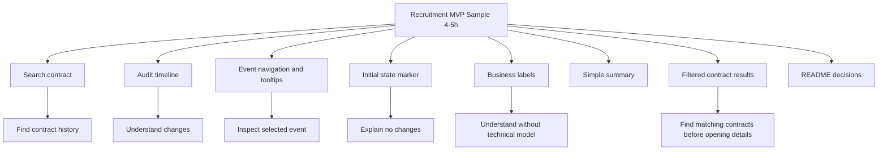
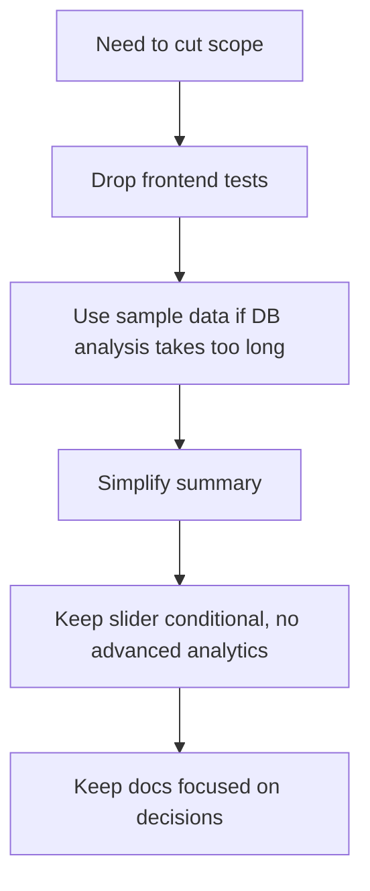
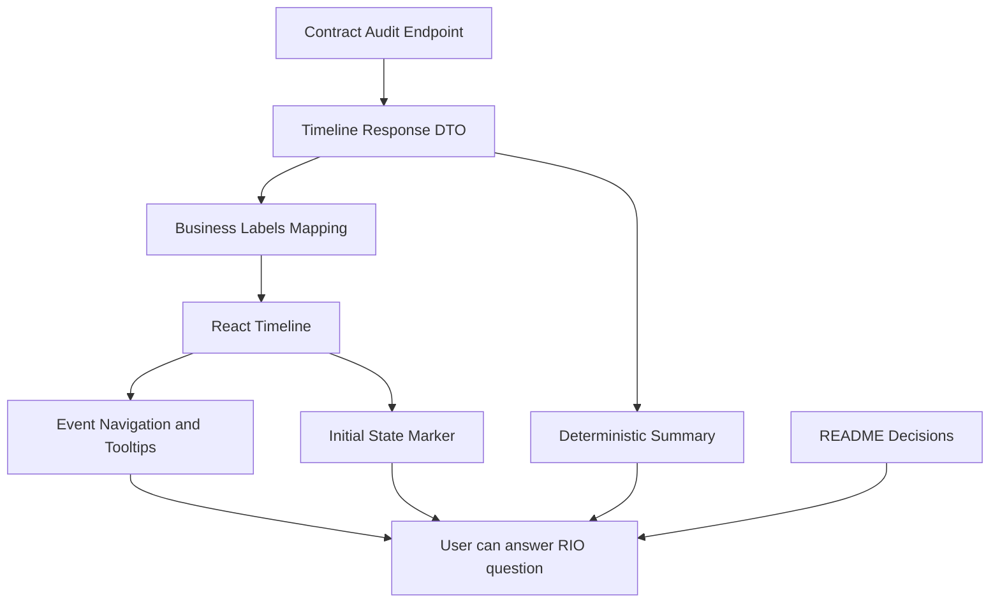

# 20. MVP Delivery Breakdown

## Cel dokumentu

Ten dokument rozbija MVP na epiki, feature’y, zadania i Definition of Done.

Zakres jest podzielony na dwa poziomy:

1. **Recruitment MVP sample** — realny zakres na około **4–5 godzin**.
2. **Production-ready MVP backlog** — pełniejszy backlog, który miałby sens przy realnym wdrożeniu.

To rozróżnienie jest celowe, ponieważ zadanie rekrutacyjne ma być próbką podejścia, a nie kompletnym produktem.

---

## Cel MVP

Skarbnik przygotowuje się do kontroli RIO i potrzebuje szybko odpowiedzieć:

> Kto, kiedy i co zmienił na umowie?

MVP powinno umożliwić znalezienie tej odpowiedzi bez ręcznego analizowania technicznych wpisów `AuditLog`.

---

## Główna hipoteza MVP

Jeżeli pokażemy historię zmian jako czytelny timeline operacji biznesowych zamiast surowych rekordów technicznych, skarbnik znajdzie odpowiedź potrzebną do kontroli RIO szybciej i z mniejszą zależnością od IT.

---

## Zakres recruitment sample — 4–5h

W ramach próbki rekrutacyjnej dowożę tylko elementy konieczne do pokazania głównego podejścia.



---

## Priorytety

| Priorytet | Znaczenie |
|---|---|
| P0 | Krytyczne dla 4–5h sample |
| P1 | Warto zrobić, jeśli mieści się w timeboxie |
| P2 | Produkcyjnie przydatne, ale poza sample |
| P3 | Kierunek rozwoju po MVP |

---

# Recruitment MVP Sample Backlog

## Feature 1: Contract Audit Search

### Opis

Użytkownik może wpisać identyfikator lub numer umowy i pobrać historię zmian.

### Wartość dla skarbnika

To najkrótsza ścieżka do odpowiedzi na pytanie RIO dla konkretnej umowy.

### Priorytet

P0

### Zadania

| ID | Zadanie | Szacowany czas |
|---|---|---:|
| T1.1 | Dodać input dla ID/numeru umowy | 15 min |
| T1.2 | Dodać akcję wyszukiwania | 15 min |
| T1.3 | Podpiąć request do API lub sample data | 20–30 min |
| T1.4 | Obsłużyć loading/error/not found | 20–30 min |

### Definition of Done

- Użytkownik może wpisać umowę i rozpocząć wyszukiwanie.
- Użytkownik może zastosować filtry audytu.
- Po zastosowaniu filtrów UI pokazuje listę znalezionych umów.
- Karty znalezionych umów są klikalne i rozwijają timeline oraz summary.
- Suwak zakresu aktywności pojawia się tylko wtedy, gdy filtry zwróciły więcej niż jedną umowę.
- UI pokazuje loading state.
- UI pokazuje czytelny komunikat dla błędu lub braku umowy.
- Brak danych nie wygląda jak awaria aplikacji.

---

## Feature 2: Contract Audit Endpoint

### Opis

Backend zwraca historię zmian dla umowy jako model timeline.

### Wartość dla skarbnika

Frontend otrzymuje dane w formie gotowej do pokazania, bez konieczności rozumienia technicznego `AuditLog`.

### Priorytet

P0

### Endpoint

```http
GET /api/contracts/{contractId}/audit
```

### Zadania

| ID | Zadanie | Szacowany czas |
|---|---|---:|
| T2.1 | Utworzyć endpoint REST | 20 min |
| T2.2 | Dodać DTO `AuditTimelineResponse` | 20 min |
| T2.3 | Pobierać dane z AuditLog albo kontrolowanego sample data | 30–45 min |
| T2.4 | Zwrócić timeline items i summary | 30 min |

### Definition of Done

- Endpoint zwraca dane dla wskazanej umowy.
- Response nie jest surowym rekordem bazy.
- Response zawiera timeline items.
- Response zawiera summary.
- Endpoint da się łatwo podmienić z sample data na realny AuditLog.

---

## Feature 3: Business Labels Mapping

### Opis

System mapuje techniczne typy encji i zmian na język użytkownika.

### Wartość dla skarbnika

Skarbnik nie musi znać nazw klas ani struktury systemu.

### Priorytet

P0

### Mapowanie encji

| EntityType | Etykieta |
|---|---|
| Unknown | Nieznany obiekt |
| ContractHeaderEntity | Umowa |
| AnnexHeaderEntity | Aneks |
| AnnexChangeEntity | Zmiana aneksu |
| FileEntity | Plik |
| InvoiceEntity | Faktura |
| PaymentScheduleEntity | Harmonogram płatności |
| ContractFundingEntity | Finansowanie |

### Mapowanie typów zmian

| Type | Etykieta |
|---|---|
| Added | Dodano |
| Deleted | Usunięto |
| Modified | Zmieniono |

### Zadania

| ID | Zadanie | Szacowany czas |
|---|---|---:|
| T3.1 | Dodać mapper `EntityType -> label` | 15 min |
| T3.2 | Dodać mapper `Type -> label` | 10 min |
| T3.3 | Użyć etykiet w response DTO | 15 min |
| T3.4 | Obsłużyć `Unknown` | 10 min |

### Definition of Done

- UI pokazuje etykiety biznesowe.
- Techniczne nazwy encji nie są głównym opisem dla użytkownika.
- `Unknown` nie psuje widoku.
- Mapper jest prosty i łatwy do rozszerzenia.

---

## Feature 4: Audit Timeline

### Opis

Historia zmian jest prezentowana jako timeline, a nie tabela techniczna.

### Wartość dla skarbnika

Timeline pomaga odtworzyć kolejność zdarzeń i przygotować narrację dla RIO.

### Priorytet

P0

### Zadania

| ID | Zadanie | Szacowany czas |
|---|---|---:|
| T4.1 | Utworzyć komponent `AuditTimeline` | 30 min |
| T4.2 | Utworzyć komponent `AuditTimelineItem` | 30 min |
| T4.3 | Pokazać datę, użytkownika, typ zmiany i obiekt | 20 min |
| T4.4 | Pokazać old value -> new value | 20–30 min |
| T4.5 | Dodać podstawowy układ wizualny timeline | 30 min |

### Definition of Done

- Timeline pokazuje zmiany w kolejności czasu.
- Każdy wpis odpowiada na pytanie: kto, kiedy, co zmienił.
- Widok jest zrozumiały dla użytkownika nietechnicznego.
- Zmiany są pokazane w sposób bardziej narracyjny niż tabela.

---

## Feature 5: Event Navigation and Tooltips

### Opis

Timeline pozwala wybrać konkretne zdarzenie, przejść poprzednie/następne i zrozumieć ikonę przez tooltip.

### Wartość dla skarbnika

Użytkownik może szybko przejść po historii i zobaczyć szczegóły pojedynczej zmiany bez czytania tabeli technicznej.

### Priorytet

P0

### Zadania

| ID | Zadanie | Szacowany czas |
|---|---|---:|
| T5.1 | Dodać klikalne punkty timeline | 20 min |
| T5.2 | Dodać strzałki poprzednie/następne | 15 min |
| T5.3 | Dodać tooltipy dla ikon zdarzeń | 20 min |
| T5.4 | Pokazać aktywne zdarzenie w karcie szczegółów | 20–30 min |

### Definition of Done

- Punkty timeline są klikalne.
- Tooltip wyjaśnia, jaką akcję reprezentuje ikona.
- Strzałki pozwalają przejść do poprzedniego i następnego zdarzenia.
- Karta aktywnego zdarzenia pokazuje datę, użytkownika, akcję, obiekt, pole i zmianę wartości.

---

## Feature 6: Initial State Marker

### Opis

Jeżeli umowa nie ma zmian po utworzeniu, system pokazuje jeden znacznik na timeline reprezentujący stan pierwotny.

### Wartość dla skarbnika

Brak zmian też jest odpowiedzią dla RIO. Pusty ekran byłby niejednoznaczny.

### Priorytet

P0

### Zadania

| ID | Zadanie | Szacowany czas |
|---|---|---:|
| T6.1 | Rozpoznać brak zmian dla umowy | 15 min |
| T6.2 | Utworzyć timeline item typu `Initial state` | 20 min |
| T6.3 | Pokazać komunikat „Po utworzeniu nie odnotowano zmian” | 15 min |
| T6.4 | Uwzględnić initial state w UI | 15 min |

### Definition of Done

- Brak zmian nie pokazuje pustego widoku.
- Użytkownik widzi jeden znacznik stanu pierwotnego.
- Użytkownik może jasno odpowiedzieć, że po utworzeniu umowy nie było zmian.
- Ten stan jest odróżniony od błędu i braku umowy.

---

## Feature 7: Deterministic Summary

### Opis

System pokazuje krótkie podsumowanie historii zmian.

### Przykład

```text
W wybranym okresie znaleziono 8 zmian.
Zmiany wykonało 3 użytkowników.
Najczęściej zmieniano: Harmonogram płatności.
```

### Wartość dla skarbnika

Skarbnik szybciej rozumie skalę zmian przed wejściem w szczegóły.

### Priorytet

P1

### Zadania

| ID | Zadanie | Szacowany czas |
|---|---|---:|
| T7.1 | Policzyć liczbę wszystkich zmian | 10 min |
| T7.2 | Policzyć zmiany per typ | 10 min |
| T7.3 | Policzyć liczbę użytkowników | 10 min |
| T7.4 | Pokazać summary nad timeline | 20–30 min |

### Definition of Done

- Summary jest wyliczane z danych.
- Summary nie używa LLM.
- Summary nie dodaje faktów spoza timeline.
- Summary pomaga zorientować się w historii.

---

## Feature 8: README and Decision Notes

### Opis

Dokumentacja opisuje, co zostało zbudowane, co odpuszczono i jak rozwiązanie może ewoluować.

### Wartość dla rekrutacji

Zadanie ocenia tok myślenia. Dokumentacja pokazuje decyzje, a nie tylko kod.

### Priorytet

P0

### Zadania

| ID | Zadanie | Szacowany czas |
|---|---|---:|
| T8.1 | Opisać cel MVP | 10 min |
| T8.2 | Opisać 3 decyzje niewymuszone przez zadanie | 20 min |
| T8.3 | Opisać świadomie odpuszczony zakres | 20 min |
| T8.4 | Opisać architekturę docelową | 20–30 min |
| T8.5 | Dodać instrukcję uruchomienia | 10–15 min |

### Definition of Done

- README wyjaśnia cel MVP.
- README zawiera decyzje uzasadnione wartością dla skarbnika lub biznesu.
- README mówi, czego nie zbudowałem i dlaczego.
- README odróżnia sample 4–5h od produkcyjnego MVP.

---

# Recruitment Sample Summary

| Feature | Priorytet | Estymacja |
|---|---|---:|
| Contract Audit Search | P0 | 45–60 min |
| Contract Audit Endpoint | P0 | 75–90 min |
| Business Labels Mapping | P0 | 30–45 min |
| Audit Timeline | P0 | 90–120 min |
| Event Navigation and Tooltips | P0 | 45–60 min |
| Initial State Marker | P0 | 30–45 min |
| Deterministic Summary | P1 | 30–45 min |
| README and decisions | P0 | 45–60 min |

Ponieważ część prac może być wykonywana równolegle lub uproszczona, realny timebox dla sample to około **4–5 godzin**.

---

# Minimum Cut if Timebox Gets Tight

Jeżeli czas zaczyna przekraczać 4–5 godzin, tnę zakres w takiej kolejności:



## Nie tnę

- timeline,
- mapowania na język biznesowy,
- stanu pierwotnego,
- README z decyzjami,
- jasnego odpuszczenia overengineeringu.

---

# Production-ready MVP Backlog

Poniższe elementy mają sens przy realnym wdrożeniu, ale nie są częścią 4–5h sample.

| Feature | Priorytet produkcyjny | Opis |
|---|---|---|
| Auth / RBAC | P0 | Dostęp tylko dla uprawnionych użytkowników |
| Audit access log | P0 | Logowanie, kto przeglądał historię |
| Pagination / server-side filtering | P0 | Ochrona przed dużymi wynikami |
| App Insights | P0 | Monitoring błędów i latency |
| Correlation ID | P1 | Łączenie requestów i operacji |
| Advanced filter presets | P1 | Zapisywanie często używanych filtrów i widoków |
| Export PDF / Excel | P1 | Przygotowanie paczki dla RIO |
| Integration tests | P1 | Stabilność API |
| Frontend tests | P1 | Stabilność UI |
| OpenSearch / Azure AI Search | P2 | Wyszukiwanie po wielu umowach i modułach |
| Event-driven audit | P3 | Przy wielu źródłach audytu |

---

# Dependency Map



---

# Suggested Commit Breakdown

```text
docs: add product discovery and architecture planning
feat(api): add contract audit endpoint
feat(api): map audit log entries to timeline response
feat(ui): add contract audit search and timeline
feat(ui): add event navigation and tooltips for audit timeline
feat(ui): show initial state when contract has no changes
feat(api): add deterministic audit summary
docs: add MVP decisions and scope trade-offs
```

---

# Definition of Done dla recruitment sample

Sample uznaję za skończony, gdy:

1. Użytkownik może wyszukać umowę.
2. System pokazuje timeline zmian.
3. Timeline pokazuje kto, kiedy i co zmienił.
4. Punkty timeline mają tooltipy i można je wybrać.
5. Strzałki pozwalają przechodzić między zdarzeniami.
6. Jeżeli nie było zmian, system pokazuje stan pierwotny jako jeden znacznik.
7. Techniczne nazwy encji są zastąpione etykietami biznesowymi.
8. Summary daje szybki obraz historii.
9. README opisuje decyzje i świadomie odpuszczony zakres.
10. Rozwiązanie nie udaje production-ready platformy.

---

# Co blokuje sample

| Bloker | Dlaczego |
|---|---|
| Brak timeline | Nie ma głównej wartości dla skarbnika |
| Brak danych lub sample data | Nie da się pokazać historii |
| Brak mapowania encji | Widok pozostaje techniczny |
| Brak README z decyzjami | Zadanie nie pokazuje toku myślenia |
| Brak obsługi „brak zmian” | Użytkownik nie wie, czy brak danych to błąd |

---

# Co nie blokuje sample

| Element | Dlaczego nie blokuje |
|---|---|
| Pełne testy | Cenne produkcyjnie, ale mniej ważne niż vertical slice |
| GraphQL | REST wystarcza |
| Event Sourcing | Existing AuditLog wystarcza do historii |
| LLM | Ryzyko halucynacji i koszt większy niż wartość w sample |
| Export | Niepotrzebny do walidacji głównej hipotezy |
| Production auth | Produkcyjnie konieczne, ale poza próbką |
| Mikroserwis | Za wcześnie na niezależny lifecycle |

---

# Najważniejsza zasada delivery

Każde zadanie powinno przejść przez pytanie:

> Czy to pomaga skarbnikowi szybciej odpowiedzieć: kto, kiedy i co zmienił?

Jeżeli odpowiedź brzmi „nie”, zadanie powinno zostać odłożone poza recruitment MVP sample.
